# オトナのPython入門#Discord_Bot編
2019年5月22日

オトナのプログラミング勉強会<br>
協力 **未来会議室**

[connpass](https://otona.connpass.com)<!--- .element target="_blank" -->

---

# 自己紹介

- 村上　卓
- フリーランス
- Angular/Ruby On Rails

---

オトナのプログラミング勉強会<br>
[http://otona.pro](http://otona.pro)<!--- .element target="_blank" -->

- 2016年8月から開始
- 月2回（第1水曜、第3水曜）
- いつでも講師募集中
    - プログラム言語、機械学習、Web系...
- [YouTube Live](https://www.youtube.com/channel/UCrXf76sF5RUKcGpMpZASqow)<!--- .element target="_blank" -->でリモート参加も振り返りも可(?)

---

# Discord Botを作ろう

---

# Discord


- ゲーマー向けボイス＆テキストチャット
- 自分でサーバを立ててチャンネルを作成
- Steamなどのゲームプラットフォームの連携がすごい
- SlackとかSkypeとかMSN(Live)メッセンジャーみたいなの

---

# BOT

- 人間に変わって作業をしてくれるロボット
- DiscordではBOTユーザとして参加
- BOT機能を自分でつくろう
  - 挨拶
  - おみくじ
  - 簡易電卓

---

# 前準備

mirai-techサーバに参加しよう  

- Discordアカウントを作成
- 招待URLからサーバを追加

自分のサーバがある場合そちらを利用して良いです

---

# 前準備#1

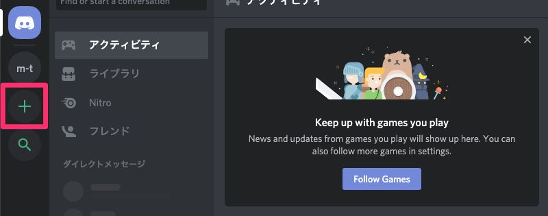

---

# 前準備#2

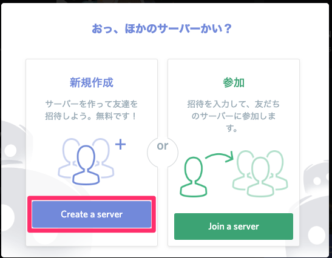

---

# 前準備#3

招待URL: [https://discord.gg/aFdEBby](https://discord.gg/aFdEBby)

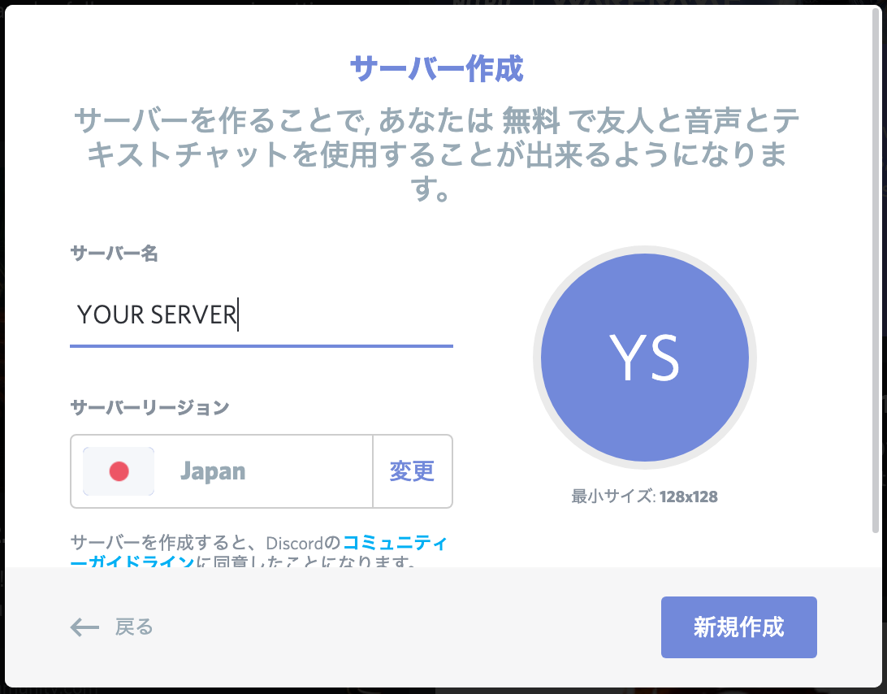

---

# 開発環境#1

- Python 3.5.3以降

Python実行環境がない方は以下のURLにアクセス  
[https://coder.otona.pro](https://coder.otona.pro)


---

# 開発環境#2

discord.pyをpipでダウンロード(coderの方は必要なし)

```
# Mac or Linux
$ python3 -m pip install -U discord.py

# Windows
$ py -3 -m pip install -U discord.py
```

---

# ワークスペース作成(coder)

他の方とファイルが被らないように自分のフォルダを作成  
[Terminal] -> [New Terminal]

```console
$ mkdir [YOUR_ID]
$ cd [YOUR_ID]
```

---

# メインファイル作成

```
$ touch bot.py
```

---

# 雛形

```python
# bot.py
import discord
# あとで取得したものを↓と差し替えてください
TOKEN = 'YOUR_ACCESS_TOKEN'

client = discord.Client()

@client.event
async def on_ready():
    print("Logged In")

@client.event
async def on_message(message):
    if message.author.bot:
        return
    if message.content == '/neko':
        await message.channel.send('にゃー')

client.run(TOKEN)
```

---

# アクセストークントークン#1

以下のURLにアクセス

[https://discordapp.com/developers/applications/](https://discordapp.com/developers/applications/)

---

# アクセストークントークン#2
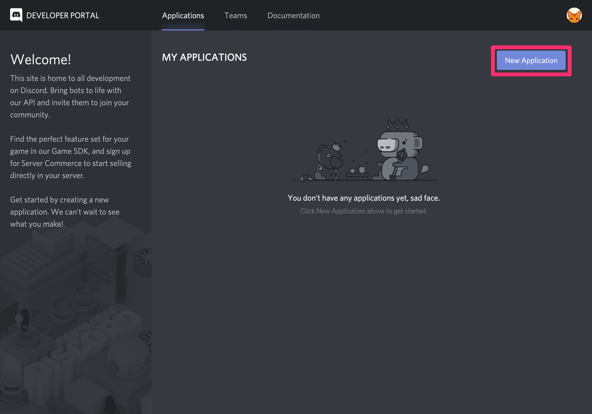

---

# アクセストークントークン#3
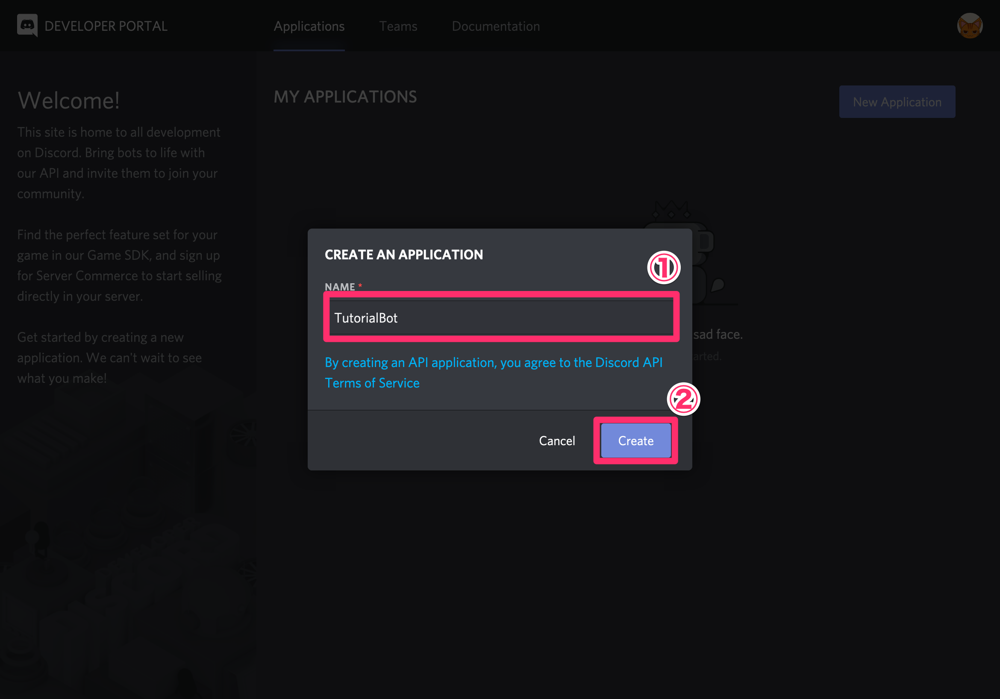

---

# アクセストークントークン#4
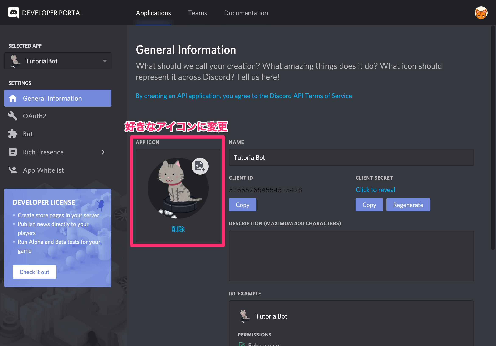

---

# アクセストークントークン#5
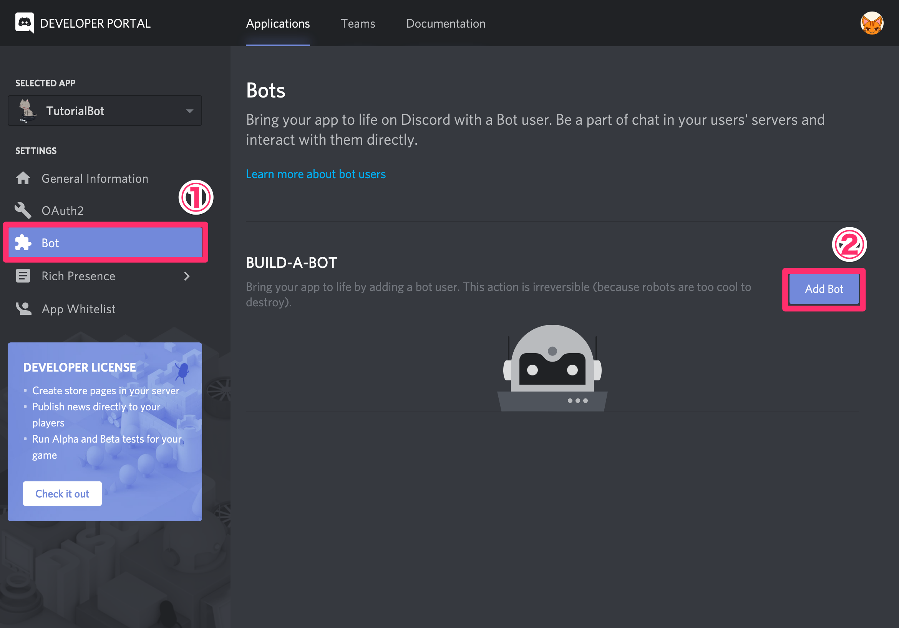

---

# アクセストークントークン#6
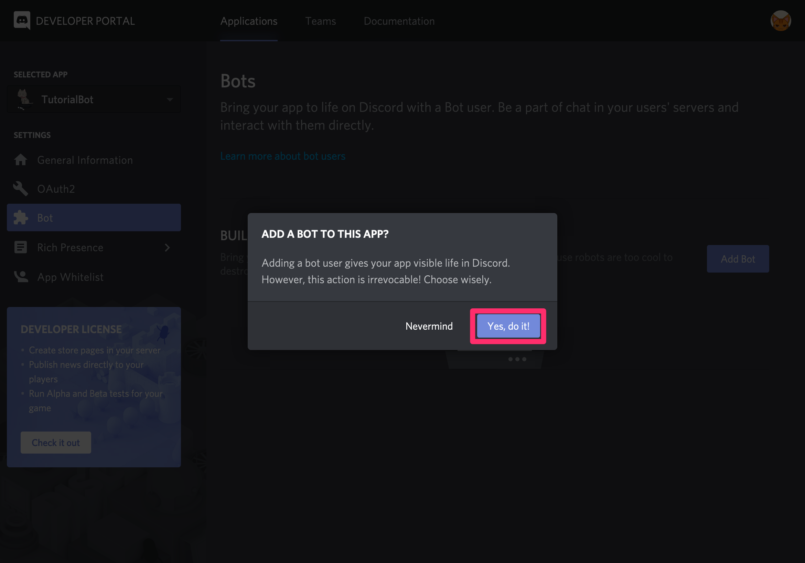

---

# アクセストークントークン#7
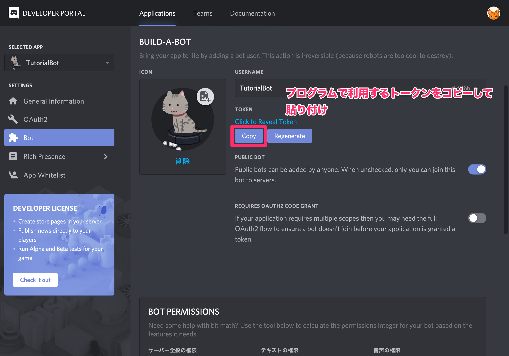

---

# アクセストークントークン#8
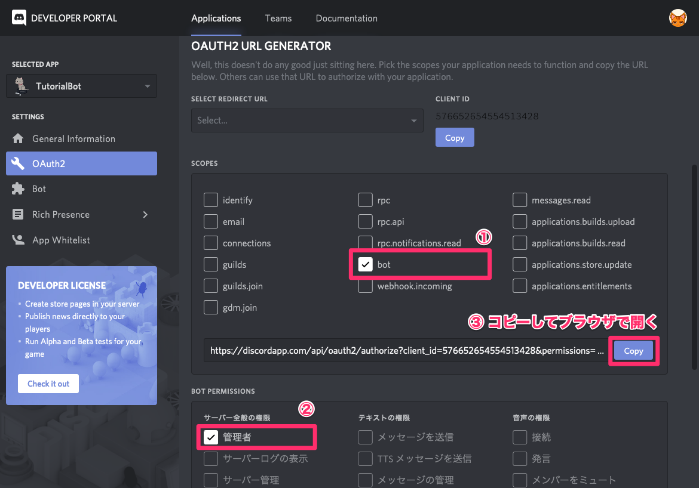

---

# アクセストークントークン#9
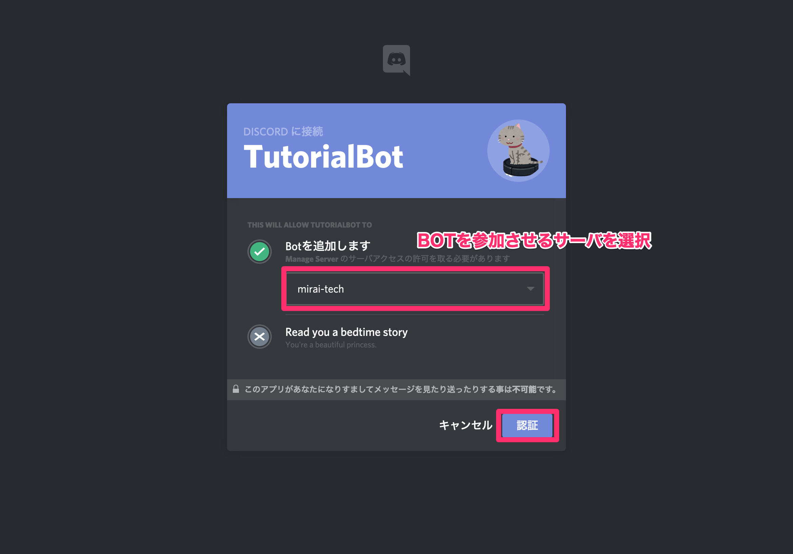

---

# アクセストークントークン#10
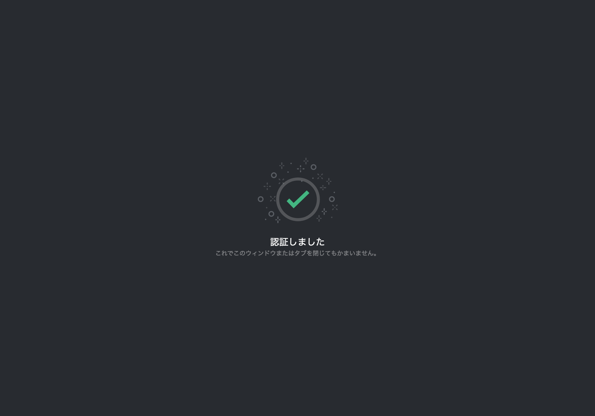

---

# BOT実行

```console
$ cd [YOUR_ID]
$ python3 bot.py 
Logged In

# アクション待ち
# Ctrl+cで終了
```

---

# テスト

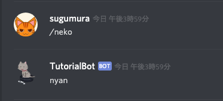

---

# おつかれさまでした🍵
