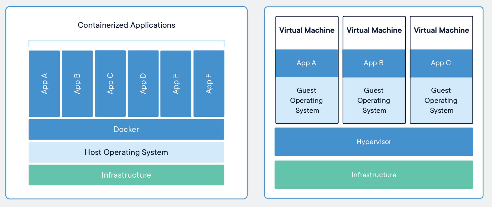
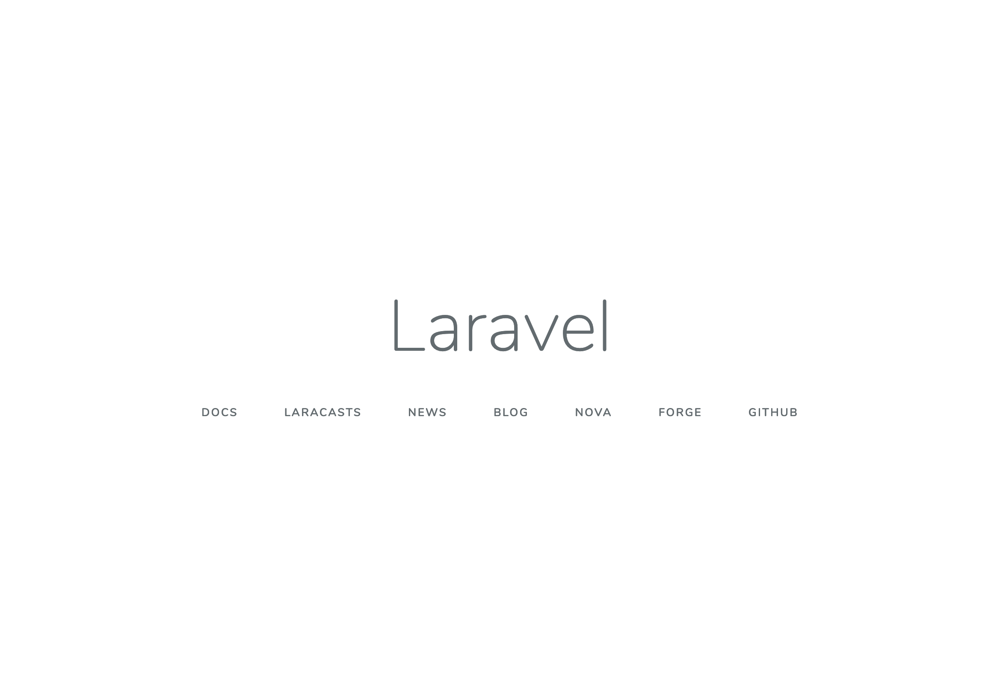
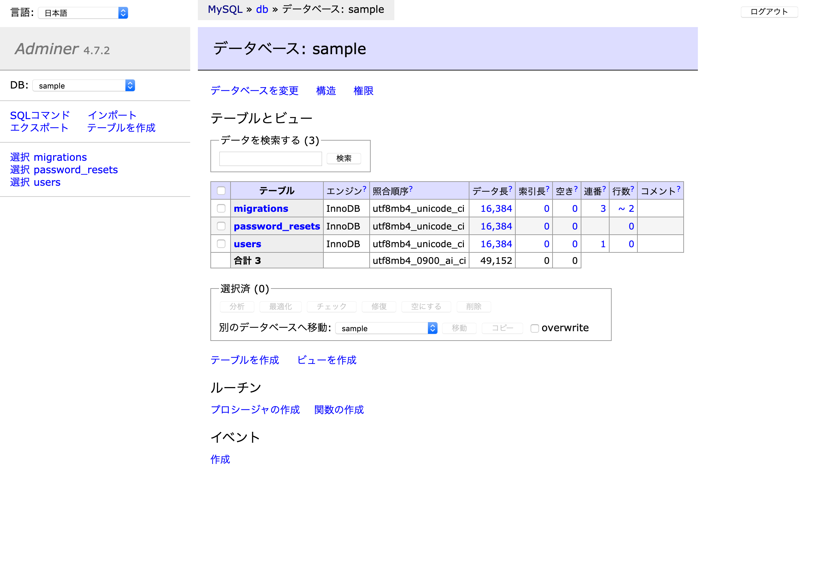

# オトナのDocker入門<br>#LAMP環境を作ろう
2019年8月7日

オトナのプログラミング勉強会<br>
協力 **未来会議室**

[connpass](https://otona.connpass.com)<!--- .element target="_blank" rel="noopener" -->

---

# 自己紹介

- 村上　卓
- フリーランス
- Angular/Ruby On Rails

---

オトナのプログラミング勉強会<br>
[http://otona.pro](http://otona.pro)<!--- .element target="_blank" rel="noopener" -->

- 2016年8月から開始
- 月2回（第1水曜、第3水曜）
- いつでも講師募集中
    - プログラム言語、機械学習、Web系...
- [YouTube Live](https://www.youtube.com/channel/UCrXf76sF5RUKcGpMpZASqow)<!--- .element target="_blank" rel="noopener" -->でリモート参加も振り返りも可(?)

---

# 注意

資料をMac環境で作成しているため、基本的にパス表示はMacOSXです  
WindowsやLinux環境の方は読み替えていただくか、不明な場合は質問してください

また、Docker使用中は電源アダプタの利用をおすすめします

---

# Dockerをはじめよう

<!--- .element width="50%" height="50%" style="box-shadow: none; border: none;" -->

---

# Dockerとは

- コンテナ技術を利用して仮想環境を提供するもの
- コンテナの作成、配布、実行が行える
- コンテナはホストOSのカーネルを利用するため仮想マシンより軽量かつ高速
- コード化して環境を管理できるため誰でも同じ環境をつくれる
- エンタープライズ版有り

---

# 仮想マシンとの比較



引用: [https://www.docker.com/resources/what-container](https://www.docker.com/resources/what-container)

---

# Dockerを使ってみよう#1

最初にDockerデーモン(Docker for WindowsまたはMacアプリ)を立ち上げてください

デーモンが起動していないと以下のようなエラーになります

```
$ docker info
Client:
 Debug Mode: false

Server:
ERROR: Cannot connect to the Docker daemon at unix:///var/run/docker.sock. Is the docker daemon running?
```

---

# Dockerを使ってみよう#2

[hello-world](https://hub.docker.com/_/hello-world/)というイメージを実行します

`docker run` はイメージからコンテナを作成して実行するコマンドです

```
$ docker run hello-world
Unable to find image 'hello-world:latest' locally
latest: Pulling from library/hello-world
1b930d010525: Pull complete
Digest: sha256:6540fc08ee6e6b7b63468dc3317e3303aae178cb8a45ed3123180328bcc1d20f
Status: Downloaded newer image for hello-world:latest

Hello from Docker!
This message shows that your installation appears to be working correctly.
...
```

---

# Dockerを使ってみよう#3

`docker run hello-world` 実行説明が出力されます

1. DockerクライアントがDockerデーモンに命令
2. DockerデーモンがDocker Hubから `hello-world` イメージを取得
3. Dockerデーモンがイメージからコンテナを作成し、実行
4. Dockerデーモンからクライアントにストリーミング

---

# Dockerを使ってみよう#4

`docker images` でダウンロード済みのイメージを確認できます

```
$ docker images
REPOSITORY          TAG                  IMAGE ID            CREATED             SIZE
hello-world         latest               fce289e99eb9        7 months ago        1.84kB
```

---

# Dockerを使ってみよう#5

`docker ps --all` でコンテナ（イメージから発生）の一覧を確認できます

```
$ docker ps --all
CONTAINER ID        IMAGE               COMMAND             CREATED             STATUS                      PORTS               NAMES
1c47470d6396        hello-world         "/hello"            17 minutes ago      Exited (0) 17 minutes ago                       interesting_goldwasser
```

---

# PHPを実行してみる#1

hello-worldは出力するだけのイメージのため、次はPHPのイメージを使用してみましょう  
PHPはオフィシャルでバージョンや環境別のイメージを公開しています  

[https://hub.docker.com/_/php](https://hub.docker.com/_/php)

どんなバージョンがあるかはGithubを見ましょう

[https://github.com/docker-library/repo-info/tree/master/repos/php/remote](https://github.com/docker-library/repo-info/tree/master/repos/php/remote)

---

# PHPを実行してみる#2

`docker pull` を使ってイメージをダウンロードします  
[イメージ名:タグ]とすることでバージョンを指定できます

```
$ docker pull php:7-cli-alpine
7-cli-alpine: Pulling from library/php
050382585609: Pull complete
e880c35ca90c: Pull complete
...
```

---

# PHPを実行してみる#3

ダウンロードしたイメージでPHPのバージョンを表示してみます

```
$ docker run php:7-cli-alpine php -v
PHP 7.3.8 (cli) (built: Aug  2 2019 06:05:30) ( NTS )
Copyright (c) 1997-2018 The PHP Group
Zend Engine v3.3.8, Copyright (c) 1998-2018 Zend Technologies
```

---

# PHPを実行してみる#4

PHPのビルドインサーバを使って、 ホストのphpファイルを表示してみます

任意の場所にフォルダを作成し`index.php`を配置しましょう  
あとでフォルダの絶対パスを指定するためパスを控えててください

```
# 例
$ mkdir ~/docker
$ touch ~/docker/index.php
```

```
// index.php
<?php
phpinfo();
```

---

# PHPを実行してみる#5

dockerを通してビルドインサーバを起動します

```
$ docker run -it -p 8080:8080 -v /Users/[USERNAME]/docker:/public php:7-cli-alpine php -S 0.0.0.0:8080 -t /public
# Ctrl+c で停止
```

起動後は以下のURLでphpinfoが表示されます  
[http://localhost:8080](http://localhost:8080)<!--- .element target="_blank" rel="noopener" -->

---

# PHPを実行してみる#6

パラメータの説明です

```
-it: 標準入力を開き、TTYを割り当てます
-p: "ホスト:コンテナ"でポート番号を指定することでポートフォワードします
-v: "ホスト:コンテナ"でパスを指定することでボリュームを割り当てします
```

---

# イメージを作ろう#1

先程のビルドインサーバの実行まで1セットになるようにオリジナルのイメージを作成します

---

# イメージを作ろう#2

DockerはDockerfile元にイメージ作成ができます
最初に `Dockerfile` という名前のファイルを作成します

```
$ cd ~/docker
$ touch Dockerfile
```

---

# イメージを作ろう#3

```
# Dockerfile
# ベースとなるイメージ名
FROM php:7-cli-alpine

# 環境変数の宣言
ENV PUBLIC_DIR /public

# 作業ディレクトリを指定
WORKDIR $PUBLIC_DIR

# ビルドするホストからイメージにファイルをコピー
COPY . $PUBLIC_DIR

# 使用するポートを宣言
EXPOSE 8080

# コンテナ作成時にコマンド実行
CMD [ "php", "-S", "0.0.0.0:8080", "-t", "/public" ]
```

---

# イメージを作ろう#4

Dockerfileを元にイメージをビルドします  
buildコマンドでファイル名を指定しない場合Dockerfileをデフォルトで利用します

```
 $ ls
Dockerfile index.php

$ docker build --tag=phpserver .
Sending build context to Docker daemon  4.608kB
...
Successfully built c186cf469288
Successfully tagged phpserver:latest
```

```
# 確認
$ docker images
REPOSITORY          TAG                  IMAGE ID            CREATED             SIZE
phpserver           latest               c186cf469288        51 minutes ago      79.3MB
```

---

# イメージを作ろう#5

作成したイメージでコンテナを起動します

```
$ docker run -p 8080:8080 phpserver
# access to http://localhost:8080
# Ctrl+c で停止
```

---

# イメージを作ろう#6

作成したイメージはイメージ内に実行するPHPファイルをコピーしています  
新規で作成したファイルや既存ファイルの変更を反映させる場合は再度ビルドする必要があります

```
$ echo "hello" >> echo.php
$ docker run -p 8080:8080 phpserver
# http://localhost:8080/echo.php is Not Found

$ docker build --tag=phpserver .
$ docker run -p 8080:8080 phpserver
# http://localhost:8080/echo.php is OK
```

---

# イメージを作ろう#7

開発中は `-v` を使ってホストのディレクトをマウントすることもできます  
この場合は再ビドルは必要ありません  
用途に合わせて使いこなしましょう

```
$ docker run -p 8080:8080 -v /Users/[USERNAME]/docker:/public phpserver
```

---

# none？

docker buildやpullをすると `<none>` というイメージが作成される場合があります  
`<none>` は同じタグ名で新しいものができた場合に古いイメージが差し替えられてできます  
今回は2回 `phpserver` というタグ名で作成したので `<none>` ができています

```
$ docker images
REPOSITORY          TAG                  IMAGE ID            CREATED              SIZE
phpserver           latest               c186cf469288        About a minute ago   79.3MB
<none>              <none>               a3b003757c76        5 minutes ago        79.3MB
```

`image prune`を使用することで削除できます  
(イメージに紐付いたコンテナがある場合削除されません)

```
$ docker image prune
WARNING! This will remove all dangling images.
Are you sure you want to continue? [y/N]
```

---

# 休憩(質問あれば)

---

# LAMP環境を作ろう

今回はLaravelというPHPフレームワークが実行できる環境を作ります  
LAMPは以下の実行環境です

- Linux
- Apache
- MySQL
- PHP

---

# Docker Composeを使おう#1

dockerコマンドを繰り返し使用することで、複数のコンテナを連携して使用することはできます  
しかし、それらを毎回入力したり依存関係がある場合は管理が大変です

Docker Composeを使用して複数のコンテナを宣言的に扱うようにできます

---

# Docker Composeを使おう#2

新しく作業ディレクトリを作成し、 `docker-compose.yml` を作成します

```
$ mkdir ~/lamp && cd ~/lamp
$ touch docker-compose.yml
```

---

# Docker Composeを使おう#3

Docker Composerではイメージ名を指定して利用する方法と、Dockerfileを指定して利用する方法があります  
まずはイメージ名を指定してMySQL実行してみましょう  

MySQLのバージョンや環境変数の設定などはURLから確認できます  
[https://hub.docker.com/_/mysql](https://hub.docker.com/_/mysql)<!--- .element target="_blank" rel="noopener" -->

また、MySQLのWebクライアントとしてAdminerを入れて同時に実行します

---

# Docker Composeを使おう#4

```
# docker-compose.yml
version: '3.7'
services:
  db:
    image: mysql:8.0.17
    restart: always
    command: --default-authentication-plugin=mysql_native_password
    environment:
      - MYSQL_ROOT_PASSWORD=password
      - MYSQL_DATABASE=sample
      - TZ='Asia/Tokyo'
    ports:
      - 3306:3306

  adminer:
    image: adminer
    restart: always
    ports:
      - 8080:8080
```

---

# Docker Composeを使おう#5

`docker-compose up` コマンドを使用してイメージをダウンロードしてコンテナを起動します  
`-d` オプションを渡すことでバックグランドで起動します

```
$ docker-compose up -d
Creating network "lamp_default" with the default driver
Pulling db (mysql:8.0.17)...
8.0.17: Pulling from library/mysql
0a4690c5d889: Already exists
98aa2fc6cbeb: Pull complete
0777e6eb0e6f: Pull complete
...
```

---

# Docker Composeを使おう#6

Adminerを通してMySQLの接続を試します  
パスワードは環境変数(environment)で渡した `password` です

[http://localhost:8080](http://localhost:8080)<!--- .element target="_blank" rel="noopener" -->

<!--- .element style="box-shadow: none; border: none;" -->


---

# Docker Composeを使おう#7

ログインできました

<!--- .element style="box-shadow: none; border: none;" -->

---

# Docker Composeを使おう#9

`down` コマンドを使用することで起動中のコンテナを破棄できます  
仮に現在の設定でMySQLにデータを保存していた場合、全て **破棄** されます

```
$ docker-compose down
```

* コンテナの起動/停止を行うstart/stopコマンドもあります

---

# Docker Composeを使おう#10

永続化を行いたい場合2つの方法があります

- Docker Volume
- ホストOSのディレクトリ

Docker Volumeはコンテナとは別に管理されるもので、コンテナが削除されても影響されません  
Docker Volumeは `volume ls` コマンドで見ることができます

```
$ docker volume ls
DRIVER              VOLUME NAME
local               3e7fe090d4ca063...
```

---

# Docker Composeを使おう#11

今回はDocker Volumeを使ってみましょう  
`docker-compose.yml` を編集します

```yml
# docker-compose.yml
version: '3.7'
services:
  db:
    image: mysql:8.0.17
    # 省略
    ports:
      - 3306:3306
    # 下2行追加
    volumes:
      - data:/var/lib/mysql
  adminer:
    # 省略
# volumesから2行追加
volumes:
  data:
```

---

# Docker Composeを使おう#12

再度 `up` コマンドを実行するとVolumeが作成されて永続化されます

```
$ docker-compose up -d
Creating network "lamp_default" with the default driver
Creating volume "lamp_data" with default driver
```

---

# Docker Composeを使おう#12

現在コンテナ起動時にDocker ComposerのcommandでMySQLの設定を変更しています  
`my.cnf` のようなファイルに記述するためcommandから差し替えましょう

docker用の設定フォルダを作成します

```
$ mkdir -p docker/db/conf.d
$ touch docker/db/conf.d/my.cnf
```

```
# my.cnf
[mysqld]
default_authentication_plugin=mysql_native_password
```

---

# Docker Composeを使おう#13

dbサービスからcommandを削除して、volumeで設定を読み込めるようにします

```yml
# docker-compose.yml
db:
    image: mysql:8.0.17
    restart: always
    # command行を削除
    environment:
      - MYSQL_ROOT_PASSWORD=password
      - MYSQL_DATABASE=sample
      - TZ='Asia/Tokyo'
    ports:
      - 3306:3306
    volumes: # 下1行追加
      - ./docker/db/conf.d/my.cnf:/etc/mysql/conf.d/my.cnf
      - data:/var/lib/mysql
```

---

# Docker Composeを使おう#14

コンテナを再起動して動作に問題ないか確認してください

```
$ docker-compose down
$ docker-compose up -d
```

---

# LAMP環境を作ろう#1

Docker Composeを使ってMySQLを立ち上げることができました  
次はApacheとPHPの実行環境を作成します  

Laravelを動かすには素のPHPイメージだけでは足りないので、Dockerfileで環境を整える必要があります  

先程のdockerコマンドでは `php:7-cli-alpine` のイメージを使用しました  
今回はApacheとPHPがセットになった `php:7-apache-stretch` を使用します

---

# LAMP環境を作ろう#2

まずはDockerfileを元にコンテナを立ち上げできるようにします

```
$ mkdir docker/web
$ touch docker/web/Dockerfile
```

```
# docker/web/Dockerfile
FROM php:7.3.8-apache-stretch

EXPOSE 80
```

---

# LAMP環境を作ろう#3

`docker-compose.yml` にwebサービスを追加します

```yml
# docker-compose
services:
  web:
    build:
      context: .
      dockerfile: ./docker/web/Dockerfile
    ports:
      - 8000:80
    volumes:
      - .:/var/www/html
  db:
  ...
```

---

# LAMP環境を作ろう#4

起動するとDockerfileをビルドして実行します

```
$ docker-compose down
$ docker-compose up -d
Creating network "lamp_default" with the default driver
Building api
Step 1/2 : FROM php:7.3.8-apache-stretch
7.3.8-apache-stretch: Pulling from library/php
0a4690c5d889: Already exists
b07fddb037ca: Pull complete
...
Application key set successfully.
```

---

# LAMP環境を作ろう#5

Apacheが実行できているか確認します

[http://localhost:8000](http://localhost:8000)<!--- .element target="_blank" rel="noopener" -->


---

# LAMP環境を作ろう#6

何か表示させたい場合は、HTMLを作成しましょう  
ホストのカレントディレクトリが公開フォルダにマウントされていることがわかります

```
$ echo "<h1>Hello</h1>" >> index.html
```


---

# LAMP環境を作ろう#7

DockerfileでLaravel実行に必要なパッケージを追加します  

```
# docker/web/Dockerfile
FROM php:7.3.8-apache-stretch

# nodeとnpmのインストール
RUN curl -sL https://deb.nodesource.com/setup_10.x | bash -
# composerのインストール
RUN curl -sS https://getcomposer.org/installer | php -- --install-dir=/usr/local/bin --filename=composer

# composerで必要なものとmysql、gd利用のためのパッケージ
RUN apt-get update \
&& apt-get install -y git gnupg unzip nodejs \
libfreetype6-dev libjpeg62-turbo-dev libpng-dev \
&& docker-php-ext-install pdo_mysql mysqli mbstring \
&& docker-php-ext-install -j$(nproc) iconv \
&& docker-php-ext-configure gd --with-freetype-dir=/usr/include/ --with-jpeg-dir=/usr/include/ \
&& docker-php-ext-install -j$(nproc) gd \
&& apt-get clean && rm -rf /var/lib/apt/lists/* \
&& a2enmod rewrite

EXPOSE 80
```

---

# LAMP環境を作ろう#8

再度イメージをビルドをします

```
$ docker-compose build web
...
# コンテナを再起動
$ docker-compose restart
```

---

# LAMP環境を作ろう#9

composerが使えるようになったので、Laravelのプロジェクトを作成します

```
$ docker-compose exec web composer create-project --prefer-dist laravel/laravel sample
Do not run Composer as root/super user! See https://getcomposer.org/root for details
Installing laravel/laravel (v5.8.17)
  - Installing laravel/laravel (v5.8.17): Downloading (100%)
...
```

* composerから警告でていますが、execやrunはユーザを指定しない場合root実行です

---

# LAMP環境を作ろう#10

composerのインストールが終わるとパスを直接叩くことでLaravelの初期画面が見えます

[http://localhost:8000/sample/public/](http://localhost:8000/sample/public/)<!--- .element target="_blank" rel="noopener" -->


<!--- .element width="50%" height="50%" -->


---

# LAMP環境を作ろう#11

ApacheとPHPの設定をできるようにします

```
$ mkdir docker/web/{sites-enabled,php}
$ touch docker/web/sites-enabled/000-default.conf
$ touch docker/web/php/php.ini
```

今回は `php.ini` は編集しませんが、触る機会は多いので入れています

---

# LAMP環境を作ろう#12

DocumentRootをLaravelのpublicフォルダにします  
また `docker-compose.yml` でマウントするフォルダにsampleを指定します

```
# docker/web/sites-enabled/000-default.conf
<VirtualHost *:80>
	ServerAdmin webmaster@localhost
	DocumentRoot /var/www/html/public
	ErrorLog ${APACHE_LOG_DIR}/error.log
	CustomLog ${APACHE_LOG_DIR}/access.log combined
</VirtualHost>
```

```yml
# docker-compose.yml
web:
  volumes: # ./:/var/www/htmlから書き換え
      - ./sample:/var/www/html
```

---

# LAMP環境を作ろう#13

ビルド時に各設定ファイルをコピーします

```
# docker/web/Dockerfile
# 省略
RUN apt-get update \
...

# 3行追加
COPY ./docker/web/php/php.ini /usr/local/etc/php/
COPY ./docker/web/sites-enabled/*.conf /etc/apache2/sites-enabled/
WORKDIR /var/www/html

EXPOSE 80
```

* `000-default.conf` は元ファイルを上書きしています

---

# LAMP環境を作ろう#14

ビルドして再起動します

```
$ docker-compose build web
$ docker-compose down
$ docker-compose up -d
```

ルートでアクセスできるようになります

[http://localhost:8000](http://localhost:8000)<!--- .element target="_blank" rel="noopener" -->

---

# LAMP環境を作ろう#14

最後にLaravelのマイグレーションを行いMySQLが使えることを確認します  
Laravelの `.env` を書き換えます

```
# sample/.env
# DB_HOST, DB_DATABASE, DB_USERNAME, DB_PASSWORD を書き換え
DB_CONNECTION=mysql
DB_HOST=db
DB_PORT=3306
DB_DATABASE=sample
DB_USERNAME=root
DB_PASSWORD=password
```

---

# LAMP環境を作ろう#15

マイグレーションをします

```
$ docker-compose exec web php artisan migrate
Migration table created successfully.
Migrating: 2014_10_12_000000_create_users_table
Migrated:  2014_10_12_000000_create_users_table (0.05 seconds)
Migrating: 2014_10_12_100000_create_password_resets_table
Migrated:  2014_10_12_100000_create_password_resets_table (0.03 seconds)
```

---

# LAMP環境を作ろう#16

Adminerで確認してみてください

<!--- .element style="box-shadow: none; border: none;" --3

---

# 終わりに

今回の環境構築はあくまで一例です  
php-fpmとapacheイメージを使って構築するものもあれば、nginxを利用したものもあります  

イメージを小さくするための方法や、マルチステージビルドといった機能も追加されています  
ぜひ今回登場していない命令や機能を使って試してみてください

---

# 後始末

不要なコンテナやイメージ、ボリュームができていると思うので、まるごとリセットしてしまうか削除コマンドを使用するとすると良いです  

```
# コンテナ一覧
$ docker ps -a
# コンテナ削除
$ docker rm [NAMES or CONTAINER_ID]

# イメージ一覧
$ docker images
# イメージ削除
$ docker rmi [IMAGE_ID]

# ボリューム一覧
$ docker volume ls
# ボリューム削除
$ docker volume rm [VOLUME_NAME]

```

---

# 資料

- [Get Started](https://docs.docker.com/get-started/)<!--- .element target="_blank" rel="noopener" -->
- [Dockerfileを改善するためのBest Practice 2019年版](https://www.slideshare.net/zembutsu/dockerfile-bestpractices-19-and-advice)<!--- .element target="_blank" rel="noopener" -->

---

# おつかれさまでした🍵
