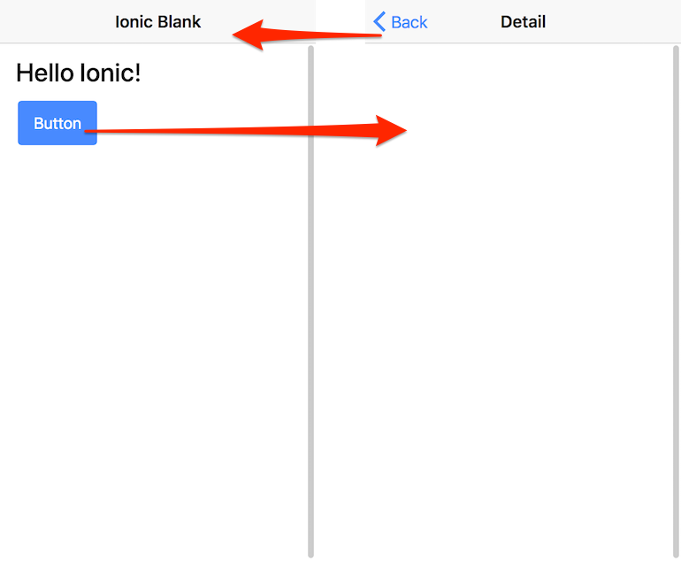
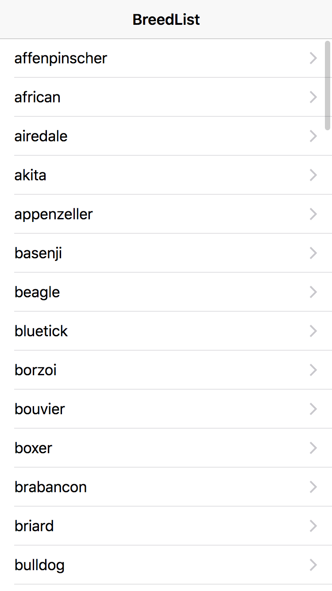
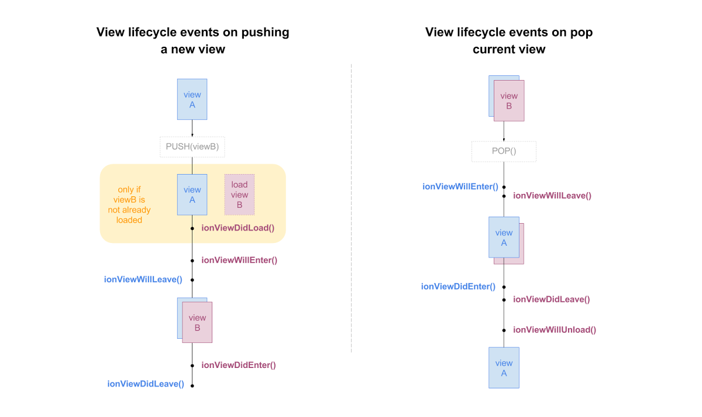
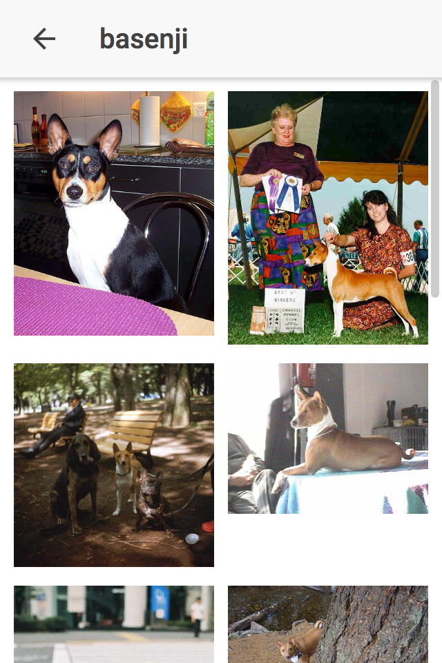
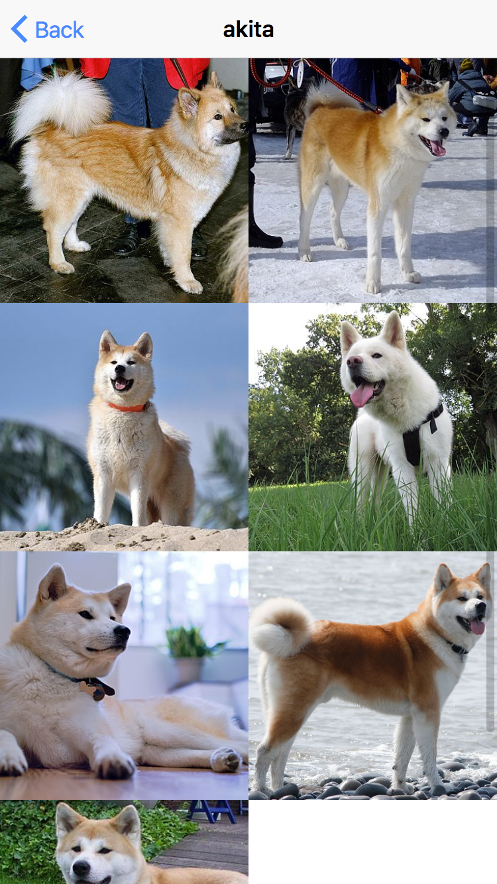
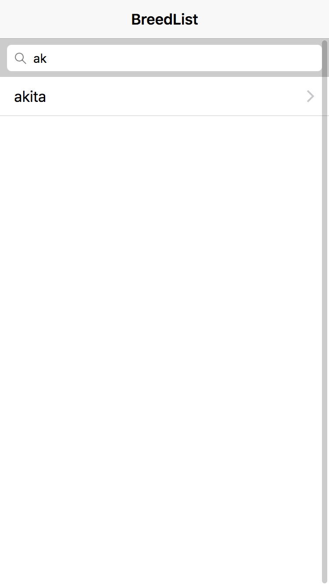
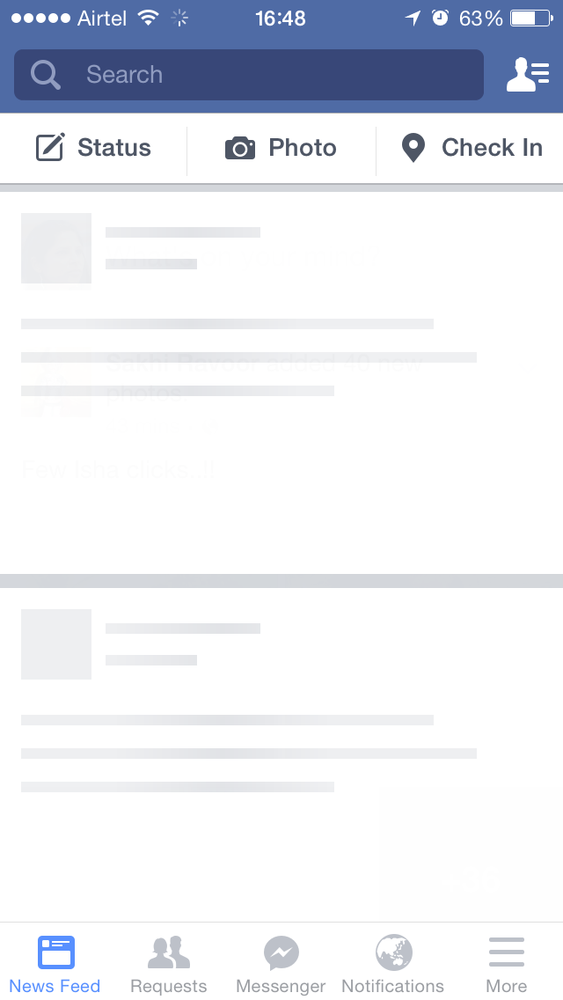
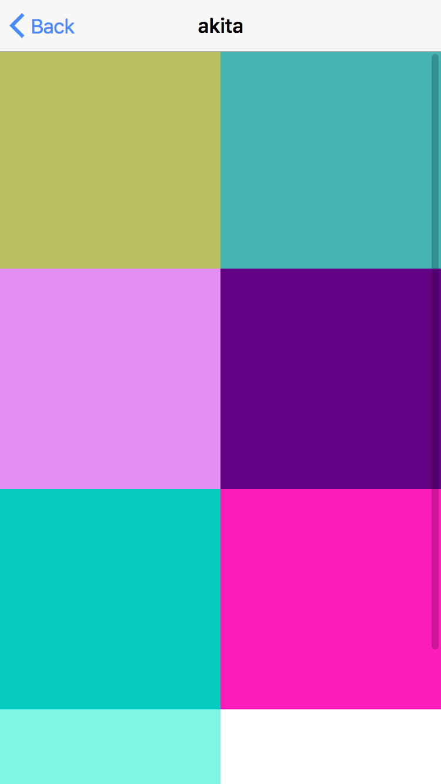

# オトナのIonic入門
2018年4月4日

オトナのプログラミング勉強会<br>
協力 **未来会議室**

[connpass](https://otona.connpass.com/event/83010/)<!--- .element target="_blank" -->

---

# 自己紹介

- 村上　卓
- 30歳
- フリーランス
- Angular/Ruby On Rails

---

オトナのプログラミング勉強会<br>
[http://otona.pro](http://otona.pro)<!--- .element target="_blank" -->

- 2016年8月から開始
- 月2回（第1水曜、第3水曜）
- いつでも講師募集中
    - プログラム言語、機械学習、Web系...
- [YouTube Live](https://www.youtube.com/channel/UCrXf76sF5RUKcGpMpZASqow)<!--- .element target="_blank" -->でリモート参加も振り返りも可(?)

---


---

# Ionicについて

- モバイルアプリのUIに特化したフレームワーク
    - 表示する環境によってiOS/Android/Windows向けにテーマ変更
    - パソコンブラウザはAndroid版がデフォルト
- Angularを使用して実装
- HTML/CSS(Sass)/TypeScript
- Cordovaとの連携
- オープンソース(MIT)
    - [ionic-team/ionic](https://github.com/ionic-team/ionic)<!--- .element target="_blank" -->

---

# Cordovaについて

- PhoneGapのオープンソース版
- HTML/CSS/JSをモバイルアプリ化
    - 内部でWebView利用
- プラグインを追加することで各ネイティブ機能が利用可
    - 例)カメラ, ギャラリー, 位置情報...


---

# IonicとCordova

- App Store/Google Playにアプリを出したい場合Cordovaを利用
    - Ionicプロジェクト作成時にCordova統合するかを選択可
- IonicチームはCordova連携用のライブラリを作成し公開
    - [Ionic Natvie](https://ionicframework.com/docs/native/)<!--- .element target="_blank" -->
- 今後ブラウザ仕様の実装でCordova使用の機会は減っていくかも…？

今回直接iOS/Android向けビルドはしないためCordovaは利用しません

---

# ハンズオン

技術的なことはたくさんありますが  
まずは動かしてみましょう

(基本的にUnixコマンドの記述です  
Windowsの方は脳内変換お願いします🙇)

---

# プロジェクト作成

```
$ ionic create hello blank

# Cordovaを利用するかの選択肢です。今回は N を入力してください
? Would you like to integrate your new app with Cordova to  
   target native iOS and Android? (y/N) N
```

---

# プロジェクト実行

実行すると自動で[http://localhost:8100](http://localhost:8100)<!--- .element target="_blank" -->にブラウザアクセスします  

```
$ cd hello
$ ionic serve
```

---

# レスポンシブデザインモード

各ブラウザでスマホ用の表示になる機能があります  
利用ブラウザで指定方法が違うため各位検索お願いします🙇

Edgeは設定大変なためその場合Chrome推奨
Firefox/Safariも村上は使ってます

---

# プロジェクト構成

重要なものだけ記述

- src
    - アプリフォルダ(次ページ詳細)
- www
    - srcフォルダからビルドファイルを配置
- ionic.config.js
    - Ionicのプロジェクト設定
- package.json
    - Node.jsによるパッケージ管理ファイル

---

# srcフォルダ

- app
    - メインモジュール
- pages
    - ページとなるコンポーネントフォルダ
- theme/variables.scss
    - ユーザテーマ用のSCSSファイル
- index.html
    - 最初の表示に呼ばれるHTML

他、機能によってproviders/pipeなどのフォルダが追加されます

---

# srcフォルダ

Service Workerという機能のための設定ファイルがデフォルトで生成されます

- manifest.json
- service-worker.js

`index.html` で有効にすることで有効化されます  
Service Workerについては今回取り上げません

---

以下、明示しない限りsrcフォルダのファイル

---

# 生成コード確認

`app/app.module.ts` から実行  
`IonicModule.forRoot` で最初に起動するコンポーネントを指定

```ts
imports: [
  BrowserModule,
  IonicModule.forRoot(MyApp)
],
bootstrap: [IonicApp], 
```

---

# MyApp

`app/app.component.ts` にMyAppの定義

```ts
@Component({
  templateUrl: 'app.html'
})
export class MyApp {
  rootPage:any = HomePage; // 表示をHomePageに

  constructor(platform: Platform, statusBar: StatusBar, splashScreen: SplashScreen) {
    platform.ready().then(() => {   
      statusBar.styleDefault();
      splashScreen.hide();
    });
  }
}
```

---

# HomePage構成

pagesフォルダには表示画面となるコンポーネント（ここではHomePage）が配置されます

- pages/home/home.html
    - HomePageのテンプレート
- pages/home/home.scss
    - HomePageのスタイルファイル
- pages/home/home.ts
    - HomePageのスクリプトファイル

---

# LiveReload

`ionic serve` で実行中はライブリロードが利用可能

```html
<!-- pages/home/home.html -->
<!-- 略 -->
<ion-content padding>
  <h1>Hello Ionic!</h1>
</ion-content>
```

---

# Master-Detail

頻出パターンであるボタンを押すと  
画面が遷移する処理を実装しましょう

---

# Generateコマンド

`ionic generate`コマンドを使うと各機能テンプレートを生成

```sh
$ ionic generate page Detail
[OK] Generated a page named Detail!
```

---

# Master-Detail

HomePageにボタンを追加しページ遷移を実装

```html
<!-- pages/home/home.html -->
<ion-content padding>
  <h1>Hello Ionic!</h1>
  <button ion-button (click)="push()">Push</button>
</ion-content>
```

```ts
// pages/home/home.ts
export class HomePage {
  constructor(public navCtrl: NavController) {
  }
  push() {
    this.navCtrl.push('DetailPage');
  }
}
```

---

`ionic serve` を再実行してテスト



---

# Lazy Loading

`pages/detail/detail.module.ts` というhomeにはないファイルが生成  
`[name].module.ts` はLazy Loadingのためのファイル

実際にそのファイルが必要になるまで読み込みを遅延し初期ロード時間を短くします

---

# 小話

HomePageもLazy Loading化できます（むしろ推奨）  
初期のころLazy Lodingがなかったため今も初期構成が昔のままのようです  
generateコマンドで生成するファイルはすべてLazy Loadingされます  

(preloadの設定も可能)

---

# Ionicのコンポーネントを使ってみよう

---

# UIコンポーネント

Ionicには沢山のUIコンポーネントが用意されている  
タグを記述するだけで利用可能

[https://ionicframework.com/docs/components/](https://ionicframework.com/docs/components/)<!--- .element target="_blank" -->

---

# リスト

Ionicのドキュメントではソースサンプルとデモをお試し可能  

[https://ionicframework.com/docs/components/#lists](https://ionicframework.com/docs/components/#lists)<!--- .element target="_blank" -->

デモのソースはgithubにある

[demos/src/list](https://github.com/ionic-team/ionic/tree/v3/demos/src/list)<!--- .element target="_blank" -->

(現在バージョン4開発中のためv3はブランチ分かれてます)

---

# UIコンポーネントを使って開発してみよう

---

# やってみたいこと

APIでデータを取得してIonicのコンポーネントで表示する

---

# Dog API

[https://dog.ceo/dog-api/](https://dog.ceo/dog-api/)<!--- .element target="_blank" -->

- APIキーなどの認証がいらないAPI
- CORS対応（重要）
- ドキュメントとサンプルがある（重要）
- 120種2万枚以上画像があるらしい

---

# 機能要件

- 犬種リストを表示
- 犬種を選択すると画像タイルページに遷移
- 画像タイルで前ページに選択した犬種画像を表示
- 犬種リストの文字列検索
- 画像タイルの無限スクロール処理（時間あれば）

---

# ページ生成

新しく犬種リストのページを生成します  
あとで使う画像タイルページも生成しておきます

```sh
# g は generate の省略
# 犬種リスト
$ ionic g page BreedList

# 画像タイル
$ ionic g page BreedTile
```

---

# 初期画面の変更

最初に開くページをHomePageからBreedListPageに変更

```ts
// app/app.component.ts

export class MyApp {
  // rootPage:any = HomePage;
  rootPage:any = 'BreedListPage';   // 文字列指定

}
```

---

# HttpClientの読み込み

Angularが用意しているHttpClientモジュールを読み込み使用できるように  
変更後 `ionic serve` を再実行

```ts
// app/app.module.ts
// 追加
import { HttpClientModule } from '@angular/common/http';

@NgModule({
// ...
  imports: [
    BrowserModule,
    HttpClientModule,  // 追加
    IonicModule.forRoot(MyApp)
  ],
// ...
```

---

# APIインターフェイス

API用に型定義をする  
今回は簡易的な実装のためページ内定義

```ts
// pages/breed-list/breed-list.ts
// import文の後ぐらいに記述
interface BreedListResponse {
   status: string;
   message: Array<string>;
}
```

---

# APIからデータ取得

```ts
// pages/breed-list/breed-list.ts
import { HttpClient } from '@angular/common/http';
// ... 省略
export class BreedListPage {
  list: Array<string> = [];

  constructor(public navCtrl: NavController,
    private http: HttpClient) {
  }

  ionViewDidLoad() {
    this.http.get<BreedListResponse>('https://dog.ceo/api/breeds/list')
    .subscribe((response) => {
      this.list = response.message;
    })
  }
}
```

---

# テンプレート

APIからデータ取得後テンプレートに表示を反映

```html
<!-- pages/breed-list/breed-list.html -->
<ion-content>
  <ion-list>
    <button ion-item *ngFor="let item of list">
      {{ item }}
    </button>
  </ion-list>
</ion-content>
```

---

# リスト表示

<!-- .element height="32%" width="32%" -->

---

# ライフサイクル

Ionicではページのライフサイクルを定義



ref: [https://blog.ionicframework.com/navigating-lifecycle-events/](https://blog.ionicframework.com/navigating-lifecycle-events/)<!--- .element target="_blank" -->

---

# ページ遷移

リストをタップするとページ移動  
その際押したアイテム情報を遷移先に渡す

```html
<!-- pages/breed-list/breed-list.html -->
<!-- (click)部分追加 -->
<button ion-item *ngFor="let item of list" (click)="goBreedTile(item)">
```

```ts
// pages/breed-list/breed-list.ts
ionViewDidLoad() {
    // ...
}
goBreedTile(item) {
  this.navCtrl.push('BreedTilePage', {breed: item});
}
```

---

# 画像タイルでデータ取得

前ページの犬種データを取得  
ページタイトルを変更

```ts
// pages/breed-tile/breed-tile.ts
export class BreedTilePage {
  breed: string;

  constructor(public navCtrl: NavController,
    public navParams: NavParams) {
      this.breed = this.navParams.get('breed');
      if (this.breed) {
        console.log('犬種は？', this.breed);
      } else {
        this.navCtrl.setRoot('BreedListPage');
      }
  }
}
```

---

# 犬種をタイトルに表示

```html
<!-- pages/breed-tile/breed-tile.html -->
<ion-header>
  <ion-navbar>
    <ion-title>{{ breed }}</ion-title>
  </ion-navbar>
</ion-header>
```

---

# タイルを表示

<ion-grid>を使用することでタイルっぽくする

```html
<!-- pages/breed-tile/breed-tile.html -->
<ion-content>
  <ion-grid>
    <ion-row>
      <ion-col col-6 *ngFor="let tile of [0,1,2,3,4,5]">
        
      </ion-col>
    </ion-row>
  </ion-grid>
</ion-content>
```

ref: [Grid](https://ionicframework.com/docs/api/components/grid/Grid/) <!--- .element target="_blank" -->

---

# APIインターフェイス(2)

API用に型定義をする  

```ts
// pages/breed-list/breed-tile.ts
// import文の後ぐらいに記述
interface BreedImageListResponse {
  status: string;
  message: Array<string>;
}
```

---

# APIから画像を取得

```ts
// pages/breed-tile/breed-tile.ts
import { HttpClient } from '@angular/common/http';
//...省略
export class BreedTilePage {
  breed: string;
  tiles: Array<string>;
  constructor(/* 省略, */ private http: HttpClient,
  ) {
//...省略
  ionViewDidLoad() {
    this.http.get<BreedImageListResponse>(`https://dog.ceo/api/breed/${this.breed}../../images`)
    .subscribe((response) => {
      // すべて表示すると重いため10個ほど切り出す
      this.tiles = response.message.slice(0, 10);
    });
  }
}
```

---

# テンプレートに反映

```html
<!-- pages/breed-tile/breed-tile.html -->
<ion-content>
  <ion-grid>
    <ion-row>
      <ion-col col-6 *ngFor="let tile of tiles">
        
      </ion-col>
    </ion-row>
  </ion-grid>
</ion-content>
```

---

# 画像表示

<!-- .element height="32%" width="32%" -->

---

# レイアウト修正(HTML)

```html
<!-- pages/breed-tile/breed-tile.html -->
<ion-content>
  <ion-grid no-padding><!-- 修正 -->
    <ion-row><!-- 以下、2行修正 -->
      <ion-col col-6 no-padding *ngFor="let tile of tiles">
        
      </ion-col>
    </ion-row>
  </ion-grid>
</ion-content>
```

---

# レイアウト修正(SCSS)

```css
page-breed-tile {
  .col {
    margin-top: -3px;
  }
  .cover {
    object-fit: cover;
    width: 50vmin;
    height: 50vmin;
  }
}
```

---

# タイル表示（ぽい）

<!-- .element height="32%" width="32%" -->

---

# 検索バーを実装

---

# 検索バー追加

```html
<!-- pages/breed-list/breed-list.html -->
<ion-content>
  <ion-searchbar
  [(ngModel)]="searchWord"
  (ionCancel)="cancel()"
  ></ion-searchbar>

  <ion-list><!-- リストの取得をメソッド経由に変更 -->
    <button ion-item *ngFor="let item of getList()" (click)="goBreedTile(item)">
      {{ item }}
    </button>
  </ion-list>
</ion-content>

```

---

# 検索バー追加


```ts
// pages/breed-list/breed-list.ts
export class BreedListPage {
  // ...省略
  getList() {
    return this.list.filter(item => item.includes(this.searchWord));
  }

  cancel() {
    this.searchWord = '';
  }
}
```

---

# 検索バー実装

<!-- .element height="32%" width="32%" -->

---

# 細かな改善(?)

---

# スケルトンスクリーン

- 初期画面ロード時にフェイクのUIを表示
- プログレスバーやスピナーの代わりに表示

<!-- .element height="32%" width="32%" -->

ref: [https://blog.ionicframework.com/improved-perceived-performance-with-skeleton-screens/](https://blog.ionicframework.com/improved-perceived-performance-with-skeleton-screens/)

---


スケルトンスクリーンとまでは言わなくてもロード中のタイルを表示してみよう


---

# ランダムカラータイル

データの持ち方を変更  
タイル用にクラスを定義

```ts
// pages/breed-tile/breed-tile.ts
class Tile {
  constructor(
    public uri: string, // 画像
    public color: string,   // タイルカラー
    public load: boolean,   // 読み込み完了フラグ
  ) {}
}
```

---

# タイル処理

```ts
// pages/breed-tile/breed-tile.ts
export class BreedTilePage {
  breed: string;
  tiles: Array<Tile> = [];
  // ...省略
  ionViewDidLoad() {
    this.http.get<BreedImageListResponse>(`https://dog.ceo/api/breed/${this.breed}../../images`)
    .subscribe((response) => {
      // すべて表示すると重いため10個ほど切り出す
      const arr = response.message.slice(0, 10);
      this.tiles = arr.map((val) => new Tile(val, this.getColor(), false));
    });
  }

  getColor() {
    return `rgb(${this.getColorValue()},${this.getColorValue()},${this.getColorValue()})`;
  }

  getColorValue() {
    return Math.floor(Math.random() * 255);
  }
}
```

---

# タイルテンプレート

```html
<!-- pages/breed-tile/breed-tile.html -->
<ion-grid no-padding>
  <ion-row>
    <ion-col col-6 no-padding *ngIf="tiles.length === 0">
      
    </ion-col>

    <ion-col col-6 no-padding *ngFor="let tile of tiles; let i = index">
      
    </ion-col>
  </ion-row>
</ion-grid>
```

---

# 結果

<!-- .element height="32%" width="32%" -->

---

# 時間が残ればライブコーディング

---

# これからの学習

---

# おすすめ資料

- Ionicで作る モバイルアプリ制作入門
    - 唯一の日本語書籍。英語ドキュメントは…という方はこちらから
- Ionicの[ブログ](https://blog.ionicframework.com)
    - 目玉の機能は大体記事紹介される
- 公式ドキュメントのサンプル
    - UIを探す場合ドキュメントから引っ張ってくるのでほぼ必須

大半の問題は公式フォーラムかStackoverflowで出るぐらい活発

---

# v4開発中

@ionic/coreと@ionic/angularに分離

- Web Componentsベースに変更
- Server Side Rendering
- Angular Routerの採用

---

# 注目ツール

- Stencil
    - Webコンポーネントのコンパイラ
    - 生成したWebコンポーネントをブラウザで利用可能
    - Ionic/Angularに依存していない
- Capacitor
    - クロスプラットフォームツール
    - 既存のCordovaプラグイン互換を目指す
    - Ionic改善手段として作成を決断したとのこと
    - [Announcing Capacitor 1.0.0 Alpha](https://blog.ionicframework.com/announcing-capacitor-1-0-0-alpha/)

---

# おつかれさまでした🍵
