# RE
2019年9月20日

[connpass](https://kis-seminar.connpass.com/event/143699/)<!--- .element target="_blank" rel="noopener" -->

---

# 自己紹介

- 村上　卓
- フリーランス

普段はWebサイトの管理機能やiOS/Androidアプリの開発をしています

---

# 目次(前半)

- 構成管理
- Dockerとは
- イメージとコンテナ
- Dockerを取り巻く環境
- 利用パターン

---

# 構成管理と運用

これまでのマシンの構成管理と昨今の技術要素を一緒に振り返ってみます

---

# 構成管理

---

# 構成管理#1

アプリケーションを開発・運用する場合、それぞれ環境を用意する必要がある  
構成要素としては大きく4つになる

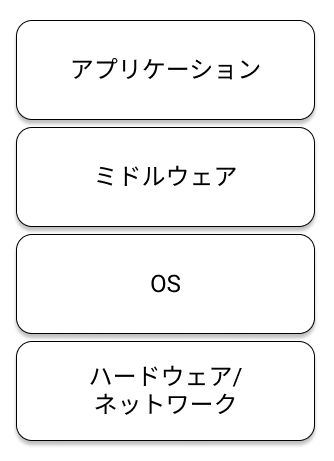

---

# 構成管理#2

マニュアルに沿って構成管理を行った場合、その後の運用によって再構築ができないケースになりがち


---

# Immutable Infrastructure

クラウドサービスの普及とともに提唱されるように

- 最初にサーバ構築を行ったあと変更を加えないこと
- 変更を加えたい場合は新たにサーバ構築を行う

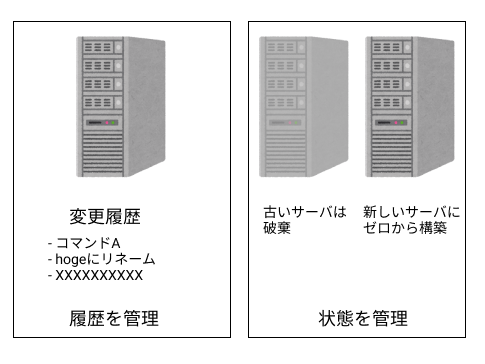

---

# Infrastracture as a code

コードで構成管理をする

- 属人性の排除
- 複数マシンへの実行が容易
- バージョン管理の適用

---

# 構成管理の分類#1

- Bootstrapping
    - OSインストール
    - ネットワーク構成
- Configuration
    - ミドルウェアのインストール・設定
- Orchestration
    - アプリケーションデプロイ
    - サーバ群の管理

---

# 構成管理の分類#2

- Bootstrapping
    - KickStart, OpenStack, Vagrant, AWS
- Configuration
    - Chef, Ansible, Puppet
- Orchestration
    - Kubernetes, Apache Mesos

---

# 構成管理でのDocker

BootstrappingとConfigurationを担う  
Dockerで正しく設計し運用することで構成管理の工数を削減することが期待できる

---

# Dockerとは

---

# Dockerとは

- コンテナ技術を利用して仮想環境を提供するもの
- コンテナの作成、配布、実行が行える
- コード化して環境を管理できるためバージョン管理を行える

---

# コンテナ

ホストOS上に論理的な区画を作成し、個別のサーバのように振る舞うもの  
コンテナはホストOSとファイルやプロセス、ネットワークなどが独立してるように見える

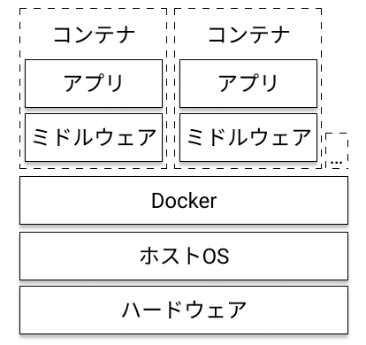

---

# 仮想化方式

他の仮想化方式も見てみましょう

---

# ホスト型仮想化

ホストOS上でゲストOSが動く

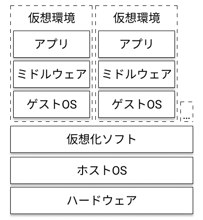

VirtualBoxやVMware Workstationなど

---

# ハイパーバイザー型仮想化

ハイパーバイザーの上でゲストOSが動く

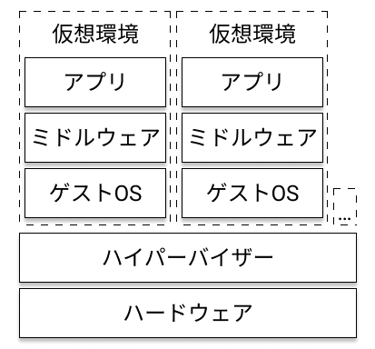

Hyper-VやXenServerなど

---

# Dockerの基本機能

Build, Ship, Runの三機能

- Dockerイメージの作成(Build)
- Dockerイメージを共有(Ship)
- Dockerイメージをコンテナとして実行(Run)

---

# Build

Dockerイメージを作成する機能

- Dockerイメージとはコンテナを作成するのに必要なファイルシステム  
- Dockerイメージがコンテナの雛形
- 読み込み専用でDockerfileという設定ファイルから作成される

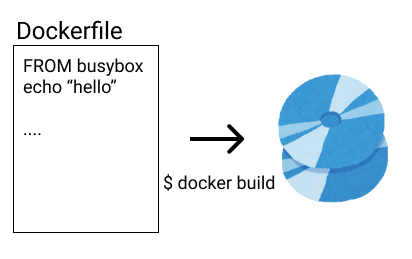

---

# Ship

Dockerイメージを共有する機能

- DockerイメージをDockerレジストリで共有可能
- 公式レジストリであるDocker HubでLinuxディストリビューションやミドルウェアのイメージが公開されている
- 個人が作成したイメージも公開、利用が可能

[https://hub.docker.com/](https://hub.docker.com/)<!--- .element target="_blank" rel="noopener" -->

---

# Run

Dockerイメージからコンテナを動かす機能

- Dockerがインストールされた環境であればどこでもコンテナを実行可能  
- Dockerイメージから複数のコンテナを起動可能

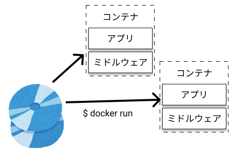

---

# イメージとコンテナ

---

# イメージとコンテナ#1

イメージとコンテナは混乱しやすいので特徴をまとめます

- Dockerイメージは読み取り専用
- コンテナはDockerイメージから作成
- コンテナは同じDockerイメージから複数起動可能
- コンテナ内で変更されたファイルはイメージに影響しない
- コンテナを破棄するとイメージからの変更内容は消失する

---

# イメージとコンテナ#2

- Dockerイメージはレイヤという層を積み上げて作成される
- コンテナとは書き込み可能なレイヤを積み上げたもの

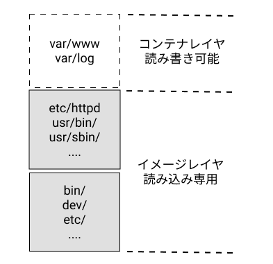

イメージのレイヤは `docker history` コマンドで確認できる

---

# 永続化

コンテナを削除するとコンテナで行った変更はすべて消失します  
Dockerでデータを永続化する場合2つの方法があります

- データボリュームの利用
- ホストディレクトリのマウント

---

# データボリューム

Dockerが提供する永続化機能  
データボリュームを作成しコンテナにマウントすることができる  
コンテナとは別に保存管理されるため、コンテナが削除されても影響しない

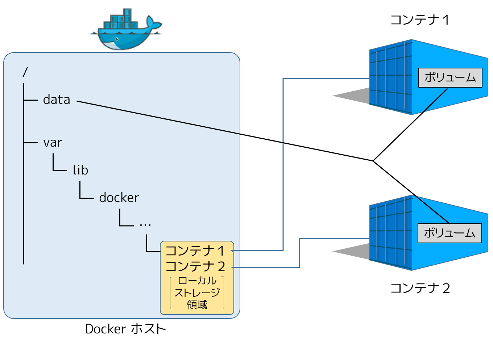<!--- .element width="50%" height="50%" -->

出典: [http://docs.docker.jp/engine/userguide/storagedriver/imagesandcontainers.html](http://docs.docker.jp/engine/userguide/storagedriver/imagesandcontainers.html)

---

# ホストディレクトリのマウント

ホストOSのファイルパスをコンテナにマウントすることができる  
永続化されるパスにマウントしデータをホスト上に残せる

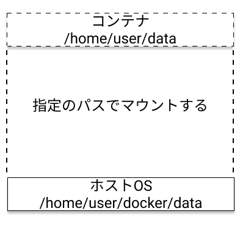

---

# Dockerの利用サイクル

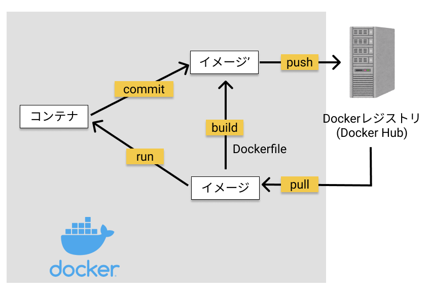

---

# Dockerコンテナの利用サイクル

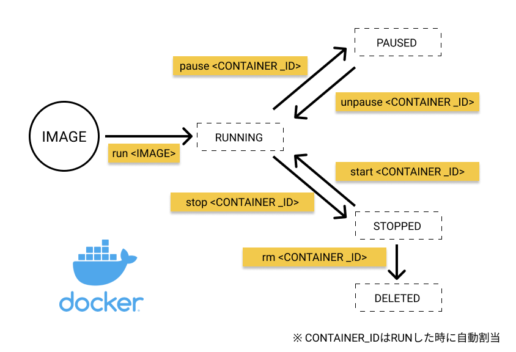

---

# コンテナの終了条件

コンテナを起動した際イメージで指定された命令がフォアグラウンドで実行される  
(指定された命令: CMDまたはENTRYPOINT)

フォアグラウンドに実行されたプロセスが終了するまでコンテナは起動し続ける

stopコマンドは `SIGTERM` を送信、すぐに終了しない場合 `SIGKILL` を送信  
(killコマンドの場合は最初からSIGKILLを送信)

---

# Dockerを取り巻く環境

---

# 現在までの流れ

2013年に発表されたDockerは瞬く間にコンテナツールとしての地位を確立しました  
主だったニュースを紹介

- 2013年
    - Dockerリリース
    - dotCloudからDocker社に社名変更
- 2014年
    - LXCから独自libcontainerに
    - GoogleがオーケストレーションツールKubernetesを発表
    - VMware、MicrosoftがDockerとの協業を発表
- 2017年
    - Moby Projectの発足
    - OCI(Open Container Intiative)の発表

---

# オーケストレーションツール

コンテナ関連のニュースでKubernetesという名前をよく見かけます  
Kubernetesの前にまずオーケストレーションツールとは何かを確認します

---

# コンテナ間の依存関係

アプリケーションを動かす場合はたくさんの依存関係がある
Dockerは単一ホストマシン上のコンテナが管理範囲

オートスケーリングや複数のホストマシンへの配置、ローリングアップデート等の機能は別で実装しなければならない

---

# オーケストレーションツール

複数のホストマシンにまたがるコンテナの配置、アップデードやロードバランサーへの紐付けを管理

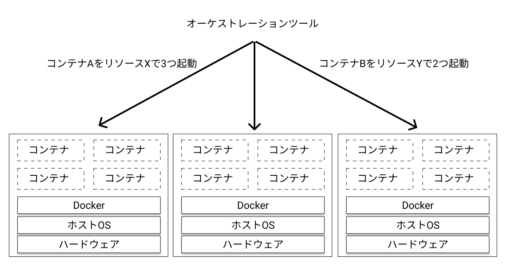

---

# Kubernetes#1

Kubernetes(クバネティス)、省略してk8sと書かれる  
Googleが設計したコンテナオーケストレーションシステム  

現在はCloud Native Computing Foundationが管理

- 複数サーバのコンテナ管理
- コンテナ間のネットワーク管理
- コンテナの負荷分散
- コンテナの監視
- コンテナのアップデート
- コンテナの自動復旧

---

# Kubernetes#2

各クラウドベンダーでもKubenetersのサービスを展開  
コンテナのオーケストレーションツールとしてはデファクトスタンダードとなった

- GKE(Google Kubenetes Engine)
- AKS(Azure Kubernetes Service)
- Amazon EKS(Amazone Elastic Kubernetes Service)

実際に使ってみる場合は一度クラウドベンダのマネージメントサービスを検討することを推奨

---

# 開発への利用パターン

基本的なDockerの機能について説明しました  
開発でどのようにDockerを使っていけるか見てみます

---

# データベースのコンテナ化

アプリケーションを作る際にデータベースは欠かせないもの  
大抵の場合公式イメージと設定ファイルを指定するだけなので導入が楽

複数のアプリを開発している場合でもDBバージョンの管理が楽に

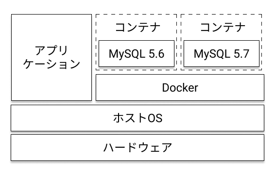

---

# アプリケーションのコンテナ化

アプリケーションとして必要な言語のランタイムやミドルウェアをコンテナ化

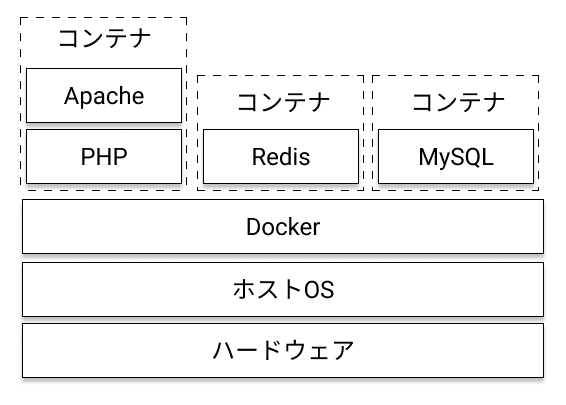

---

# サービスのコンテナ化

サービスとして必要なものをすべてコンテナ化


---

# 休憩

質問ある方は受け付けます

---

# 目次(後半)

- dockerコマンドを使おう
- Dockerfileを使ったイメージ作成
- Docker Composeを使った環境構築

---

# 注意#1

資料をMac環境で作成しているため、基本的にパス表示はMacOSXです  
WindowsやLinux環境の方は読み替えていただくか、不明な場合は質問してください

---

# 注意#2

Windowsの方は今回作業するドライブの共有を有効にしてください

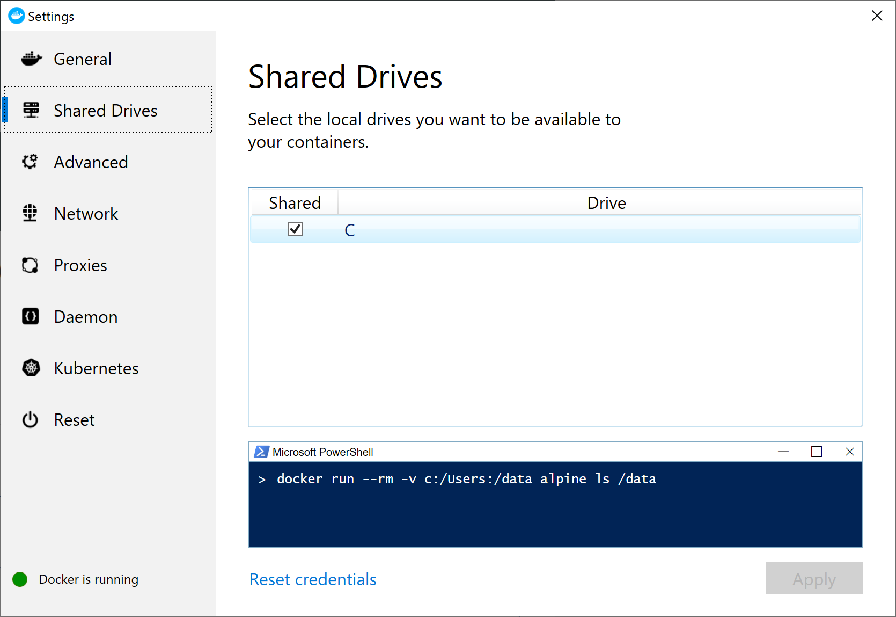<!--- .element width="50%" height="50%" -->

セキュリティソフトのファイアーウォールで警告がでる場合 `10.0.75.0(デフォルト設定)` へのアクセスを許可してください

---

# 環境が用意できなかった場合

Play with Dockerをご利用ください  
Docker Hubのアカウントが必要ですが、ブラウザでDockerを利用できます

[https://labs.play-with-docker.com/](https://labs.play-with-docker.com/)


---

# dockerコマンドを使おう

---

# docker info

最初にDockerデーモン(Docker for WindowsまたはMacアプリ)を立ち上げてください

デーモンが起動していないと以下のようなエラーになります  
infoコマンドは環境情報を表示します

```
$ docker info
Client:
 Debug Mode: false

Server:
ERROR: Cannot connect to the Docker daemon at unix:///var/run/docker.sock. Is the docker daemon running?
```

---

# docker run

`docker run` コマンドを使ってコンテナを起動してみます  
コマンドを実行するとDocker HubからイメージをDLしてコンテナを起動します

```
# docker run [イメージ名]
$ docker run hello-world
```

---

# hello-world#1

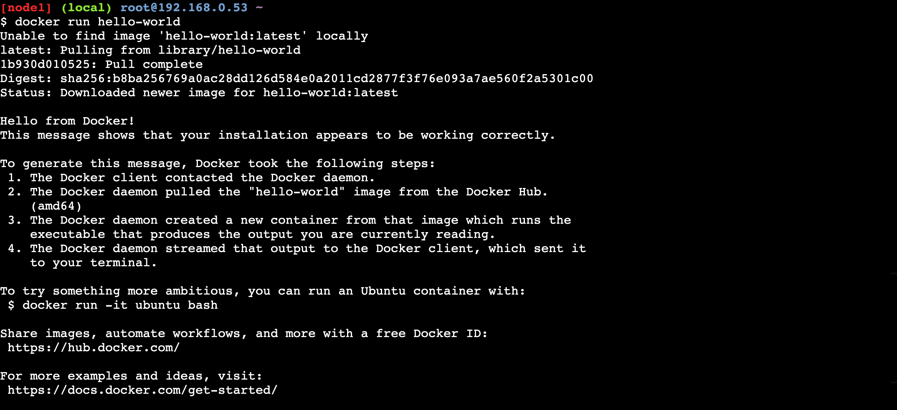

---

# hello-world#2

hello-worldはDockerの実行説明を出力します

1. DockerクライアントがDockerデーモンに命令
2. DockerデーモンがDocker Hubから `hello-world` イメージを取得
3. Dockerデーモンがイメージからコンテナを作成し、実行
4. Dockerデーモンからクライアントにストリーミング

---

# dokcer image

`docker images` でダウンロード済みのイメージを確認できます

```
$ docker images
REPOSITORY          TAG                  IMAGE ID            CREATED             SIZE
hello-world         latest               fce289e99eb9        7 months ago        1.84kB
```

---

# タグ

タグというDockerイメージをラベル付けする機能  
バージョン管理や名前で機能について説明していることが多い

`イメージ名:タグ名`

という形式で指定する(例: hello-world:latest)
タグ名を指定しない場合、 `latest` が暗黙的に利用される

---

# docker ps

`docker ps --all` でコンテナの一覧を確認できます  
--allは終了済みのコンテナを表示するため

```
$ docker ps --all
CONTAINER ID        IMAGE               COMMAND             CREATED             STATUS                      PORTS               NAMES
1c47470d6396        hello-world         "/hello"            17 minutes ago      Exited (0) 17 minutes ago                       interesting_goldwasser
```

---

# PHPイメージの利用

次はPHPのイメージを使用してみましょう  
PHPはオフィシャルでバージョンや環境別のイメージを公開しています  

[https://hub.docker.com/_/php](https://hub.docker.com/_/php)

どんなバージョンがあるかはGithubを見ましょう

[https://github.com/docker-library/repo-info/tree/master/repos/php/remote](https://github.com/docker-library/repo-info/tree/master/repos/php/remote)

---

# docker pull

`docker pull` でDocker HubからイメージをDLします

```
$ docker pull php:7-cli-alpine
7-cli-alpine: Pulling from library/php
9d48c3bd43c5: Pull complete 
4bf02c0a37c8: Pull complete 
...
```

※ `docker run` はローカルにイメージがない場合、暗黙的にpullコマンドでイメージをDLします

---

# PHPの実行

ダウンロードしたイメージでPHPのバージョンを表示してみます

```
# docker run [イメージ:タグ] [コンテナで実行するコマンド]
$ docker run php:7-cli-alpine php -v
PHP 7.3.9 (cli) (built: Sep  3 2019 06:40:35) ( NTS )
Copyright (c) 1997-2018 The PHP Group
Zend Engine v3.3.9, Copyright (c) 1998-2018 Zend Technologies
```

---

# ビルドインサーバ#1

PHPのビルドインサーバを使って、 ホストのphpファイルを表示してみます

任意の場所にフォルダを作成し`index.php`を配置しましょう  
あとでフォルダの絶対パスを指定するためパスを控えててください

```
# 例
$ mkdir ~/docker
$ touch ~/docker/index.php

# PowerShell (以降省略)
> New-Item ~/docker/index.php
```

```
// index.php
<?php
phpinfo();
```

---

# ビルドインサーバ#2

ビルドインサーバのコンテナを起動します  
dockerフォルダをpublicフォルダにマウントして公開しています

```
$ docker run -it -p 8080:8080 -v /Users/[USERNAME]/docker:/public php:7-cli-alpine php -S 0.0.0.0:8080 -t /public
# Ctrl+c で停止

# Windowsの場合(以降省略)
$ docker run -it -p 8080:8080 -v C:\Users\[USERNAME]\docker:/public php:7-cli-alpine php -S 0.0.0.0:8080 -t /public
```

起動後は以下のURLでphpinfoが表示されます  
[http://localhost:8080](http://localhost:8080)<!--- .element target="_blank" rel="noopener" -->

---

# ビルドインサーバ#3

引数の解説です

```
-it: 標準入力を開き、TTYを割り当てます
-p: "ホスト:コンテナ"でポート番号を指定することでポートフォワードします
-v: "ホスト:コンテナ"でパスを指定することでボリュームを割り当てします
```

---

# イメージ化

phpのビルドインサーバを使ったwebサーバ作れました  
Dockerfileを使ってイメージ化しましょう

Dockerfileはベースとなるイメージをもとに構成情報を記述します  
Dockerfileでは以下の基本構文で仕様します

```
命令 引数
```

---

# Dockerfile

ファイルを作成します

```
$ cd ~/docker
$ touch Dockerfile
```

---

```
# Dockerfile
# ベースとなるイメージ名
FROM php:7-cli-alpine

# 環境変数の宣言
ENV PUBLIC_DIR /public

# CMDを実行する作業ディレクトリを指定
WORKDIR $PUBLIC_DIR

# ビルドするホストからイメージにファイルをコピー
COPY . $PUBLIC_DIR

# 使用するポートを宣言
EXPOSE 8080

# コンテナで実行するコマンド
CMD [ "php", "-S", "0.0.0.0:8080" ]
```

---

# docker build

`build` コマンドでイメージを作成します

```
 $ ls
Dockerfile index.php

# docker build --tag=[タグ名] パス
$ docker build --tag=phpserver .
Sending build context to Docker daemon  4.608kB
...
Successfully built c186cf469288
Successfully tagged phpserver:latest
```

---

# docker images

`images` コマンドでイメージを確認します

```
$ docker images
REPOSITORY          TAG                 IMAGE ID            CREATED             SIZE
phpservre           latest              2395538586a9        27 seconds ago      79.4MB
php                 7-cli-alpine        49fd10364405        13 days ago         79.4MB
```

---

# docker run

`run` コマンドでコンテナを起動します

```
$ docker run -p 8080:8080 phpserver
# access to http://localhost:8080
# Ctrl+c で停止
```

**補足**

```
# Windowsの場合Ctrl+cでコンテナが停止しないためstopコマンドを使用
$ docker ps
CONTAINER ID        IMAGE               COMMAND             CREATED             STATUS                      PORTS               NAMES
1c47470d6396        hello-world         "/hello"            17 minutes ago      Exited (0) 17 minutes ago                       interesting_goldwasser

$ docker stop 1c47470d6396
```

---

# イメージの更新

作成したイメージはイメージ内にファイルをコピーしています  
新規ファイルや既存ファイルの変更を反映させる場合は再ビルドする必要があります

```
$ echo "hello" >> echo.php
$ docker run -p 8080:8080 phpserver
# http://localhost:8080/echo.php is Not Found

$ docker build --tag=phpserver .
$ docker run -p 8080:8080 phpserver
# http://localhost:8080/echo.php is OK
```

---

# none

docker buildやpullをすると `<none>` というイメージが作成される場合があります  
`<none>` は同じタグ名で新しいものができた場合に古いイメージが差し替えられてできます  
今回は2回 `phpserver` というタグ名で作成したので `<none>` ができています

```
$ docker images
REPOSITORY          TAG                  IMAGE ID            CREATED              SIZE
phpserver           latest               c186cf469288        About a minute ago   79.3MB
<none>              <none>               a3b003757c76        5 minutes ago        79.3MB
```

`docker image prune`を使用することで削除できます  
(イメージに紐付いたコンテナがある場合削除されません)

---

# 補足#1

開発中は `-v` を使ってホストのディレクトをマウントすることもできます  
この場合は再ビドルは必要ありません  
用途に合わせて使いこなしましょう

```
$ docker run -p 8080:8080 -v /Users/[USERNAME]/docker:/public phpserver
```

---

# 補足#2

Dockerfileでは他にも使える命令があります  
覚えきれないという程の数ではないため一通り読んで見ることをおすすめします

[https://docs.docker.com/engine/reference/builder/](https://docs.docker.com/engine/reference/builder/)<!--- .element target="_blank" rel="noopener" -->

---

# イメージのレイヤー構造#1

DockerイメージはDockerfileの命令ごとにイメージを作成します(45c326fccc57, 5efc78ab46cd)  
ログからビルド中に一度コンテナを作成し、破棄していることがわかります

```
Sending build context to Docker daemon  2.048kB
Step 1/6 : FROM php:7-cli-alpine
7-cli-alpine: Pulling from library/php
...
Status: Downloaded newer image for php:7-cli-alpine
 ---> 49fd10364405
Step 2/6 : ENV PUBLIC_DIR /public
 ---> Running in 4e5b4280f719
Removing intermediate container 4e5b4280f719
 ---> 45c326fccc57
...
Step 6/6 : CMD [ "php", "-S", "0.0.0.0:8080" ]
 ---> Running in 785c885b1447
Removing intermediate container 785c885b1447
 ---> 5efc78ab46cd
Successfully built 5efc78ab46cd
Successfully tagged phpserver:latest
```

---

# イメージのレイヤー構造#2

複数のイメージを積み重ねてイメージはつくられます  
共通のベースイメージ(FROM命令で指定)でイメージを作成すると共有されるため容量を効率よく利用できます

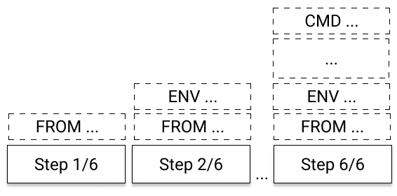

---

# Docker Composeを使った環境構築

複数のコンテナを管理しよう

---

# Docker Compose

dockerコマンドを使ってコンテナを作成しましたが  
実際のサービスのようにたくさんのコンテナを立ち上げると管理が難しくなってきます

複数のコンテナをまとめて管理するルートとしてDocker Composeが用意されています


---

# 構成

LAMP構成を作成してみましょう  

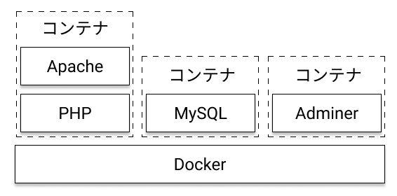

---

# Docker Composeを使おう#1

Docker Composeは `docker-compose.yml` というYAMLファイルに設定を記述して管理します  
`docker-compose` コマンドを使うことでコンテナをまとめて起動・停止することが可能です 

docker-compose.yml内で利用するイメージを指定したり、Dockerfileを指定することでイメージビルドすることができます

---

# Docker Composeを使おう#2

まずはイメージ名を指定してMySQLを起動してみましょう  

MySQLのバージョンや環境変数の設定などはURLから確認できます  
[https://hub.docker.com/_/mysql](https://hub.docker.com/_/mysql)<!--- .element target="_blank" rel="noopener" -->

また、MySQLのWebクライアントとしてAdminerを入れて同時に実行します

```
$ mkdir ~/lamp && cd ~/lamp
$ touch docker-compose.yml
```

---

# Docker Composeを使おう#3

環境変数にrootユーザのパスワードと、初回起動時に作成するDB名を記述しています

```
# docker-compose.yml
version: '3.7'
services:
  # DBサービス
  db:
    image: mysql:8.0.17
    restart: always
    command: --default-authentication-plugin=mysql_native_password
    environment:
      - MYSQL_ROOT_PASSWORD=password
      - MYSQL_DATABASE=sample
      - TZ='Asia/Tokyo'
    ports:
      - 3306:3306

  # Adminerサービス
  adminer:
    image: adminer
    restart: always
    ports:
      - 8080:8080
```

---

# Docker Composeを使おう#4

`docker-compose up` コマンドを使用してイメージをダウンロードしてコンテナを起動します  
`-d` オプションを渡すことでバックグランドで起動します

```
$ docker-compose up -d
Creating network "lamp_default" with the default driver
Pulling db (mysql:8.0.17)...
8.0.17: Pulling from library/mysql
0a4690c5d889: Already exists
98aa2fc6cbeb: Pull complete
0777e6eb0e6f: Pull complete
...
```

---

# Docker Composeを使おう#5

Adminerを通してMySQLの接続を試します  
パスワードは環境変数(environment)で渡した `password` です

[http://localhost:8080](http://localhost:8080)<!--- .element target="_blank" rel="noopener" -->

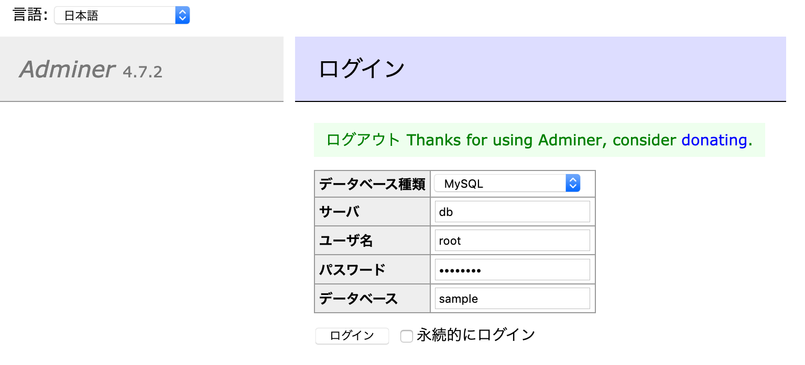<!--- .element style="box-shadow: none; border: none;" -->

---

# Docker Composeを使おう#6

ログインできました

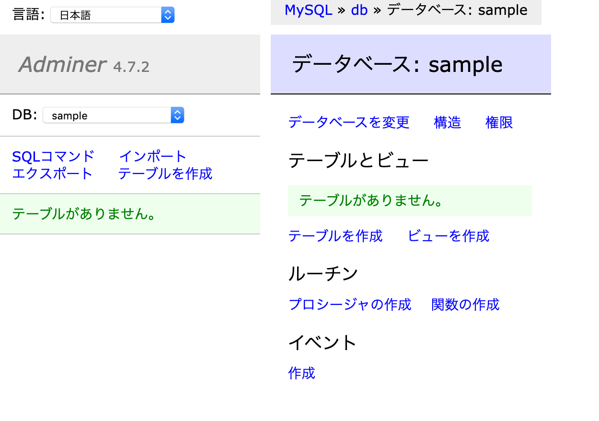<!--- .element style="box-shadow: none; border: none;" -->

---

# Docker Composeを使おう#7

`down` コマンドを使用することで起動中のコンテナを破棄できます  
仮に現在の設定でMySQLにデータを保存していた場合、全て **破棄** されます

```
$ docker-compose down
```

* コンテナの起動/停止を行うstart/stopコマンドもあります

---

# Docker Composeを使おう#8

前半で説明した通りコンテナは破棄するとすべてのデータがなくなります  
DBのデータがなくなると困るため今回はDocker Volumeで永続化します

---

# Docker Composeを使おう#9

Docker Volumeはコンテナとは別に管理されるもので、コンテナが削除されても影響されません  
Docker Volumeは `docker volume ls` コマンドで見ることができます

```
$ docker volume ls
DRIVER              VOLUME NAME
local               3e7fe090d4ca063...
```

---

# Docker Composeを使おう#10

`docker-compose.yml` を編集します

```yml
# docker-compose.yml
version: '3.7'
services:
  db:
    # 省略
    ports:
      - 3306:3306
    # 下2行追加
    volumes:
      - data:/var/lib/mysql
  adminer:
    # 省略
# volumesから2行追加
volumes:
  data:
```

[docker-compose.yml](https://github.com/sugumura/kis-open-seminar-docker/blob/step2/lamp/docker-compose.yml)<!--- .element target="_blank" rel="noopener" -->

---

# Docker Composeを使おう#11

再度 `up` コマンドを実行するとVolumeが作成されて永続化されます

```
$ docker-compose up -d
Creating network "lamp_default" with the default driver
Creating volume "lamp_data" with default driver
```

---

# Docker Composeを使おう#12

現在コンテナ起動時にDocker ComposerのcommandでMySQLの設定を変更しています  
`my.cnf` のようなファイルに記述するためcommandから差し替えましょう

docker用の設定フォルダを作成します

```
$ mkdir -p docker/db/conf.d
$ touch docker/db/conf.d/my.cnf
```

```
# my.cnf
[mysqld]
default_authentication_plugin=mysql_native_password
```

---

# Docker Composeを使おう#13

dbサービスからcommandを削除して、volumeで設定を読み込めるようにします

```yml
# docker-compose.yml
db:
    image: mysql:8.0.17
    restart: always
    # command行を削除
    environment:
      - MYSQL_ROOT_PASSWORD=password
      - MYSQL_DATABASE=sample
      - TZ='Asia/Tokyo'
    ports:
      - 3306:3306
    volumes: # 下1行追加
      - ./docker/db/conf.d/my.cnf:/etc/mysql/conf.d/my.cnf
      - data:/var/lib/mysql
```

[docker-compose.yml](https://github.com/sugumura/kis-open-seminar-docker/blob/step3/lamp/docker-compose.yml)<!--- .element target="_blank" rel="noopener" -->

---

# Docker Composeを使おう#14

コンテナを再起動して動作に問題ないか確認してください  
`docker-compose ps` コマンドでコンテナの状態が表示されます

```
$ docker-compose down
$ docker-compose up -d
$ docker-compose ps
     Name                   Command               State                 Ports              
-------------------------------------------------------------------------------------------
lamp_adminer_1   entrypoint.sh docker-php-e ...   Up      0.0.0.0:8080->8080/tcp           
lamp_db_1        docker-entrypoint.sh mysqld      Up      0.0.0.0:3306->3306/tcp, 33060/tcp
```

---

# Docker Composeを使おう#15

Docker Composeを使ってMySQLを立ち上げることができました  
次はApacheとPHPの実行環境を作成します  

最終的な動作確認のため[Lumen](https://lumen.laravel.com/)<!--- .element target="_blank" rel="noopener" -->を動かします  
PHPイメージを元にDockerfileで環境を整える必要があります  

先程のdockerコマンドでは `php:7-cli-alpine` のイメージを使用しました  
今回はApacheとPHPがセットになった `php:7-apache-stretch` を使用します

---

# Docker Composeを使おう#16

Dockerfileを元にコンテナを起動できるようにします

```
$ mkdir docker/web
$ touch docker/web/Dockerfile
```

```
# docker/web/Dockerfile
FROM php:7.3.9-apache-stretch

EXPOSE 80
```

---

# Docker Composeを使おう#17

`docker-compose.yml` にwebサービスを追加します

```yml
# docker-compose
services:
  web:
    build:
      context: .
      dockerfile: ./docker/web/Dockerfile
    ports:
      - 8000:80
    volumes:
      - .:/var/www/html
  db:
  ...
```

[docker-compose.yml](https://github.com/sugumura/kis-open-seminar-docker/blob/step4/lamp/docker-compose.yml)<!--- .element target="_blank" rel="noopener" -->

---

# Docker Composeを使おう#18

起動するとDockerfileをビルドして実行します

```
$ docker-compose down
$ docker-compose up -d
Creating network "lamp_default" with the default driver
Building api
docker-compose up -d
Creating network "lamp_default" with the default driver
Building web
Step 1/2 : FROM php:7.3.9-apache-stretch
7.3.9-apache-stretch: Pulling from library/php
8f91359f1fff: Already exists
bf2faaedf741: Pull complete
...
Application key set successfully.
```

---

# Docker Composeを使おう#19

Apacheが実行できているか確認します

[http://localhost:8000](http://localhost:8000)<!--- .element target="_blank" rel="noopener" -->

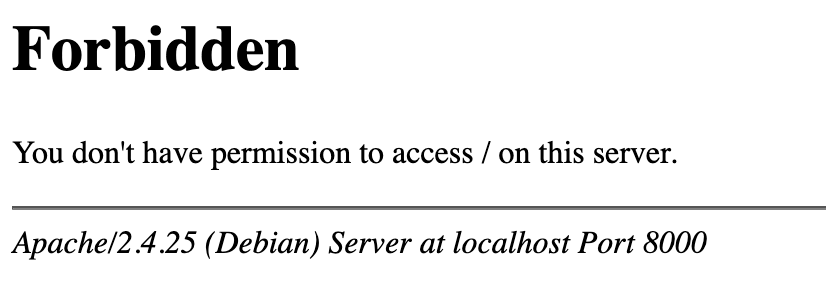

---

# Docker Composeを使おう#20

表示用にHTMLを作成しましょう  
ホストのカレントディレクトリが公開フォルダにマウントされていることがわかります

```
$ echo "<h1>Hello</h1>" >> index.html
```


---

# Docker Composeを使おう#21

Dockerfileに実行に必要なパッケージを追加します  

```
# docker/web/Dockerfile
FROM php:7.3.9-apache-stretch

# composerのインストール
RUN curl -sS https://getcomposer.org/installer | php -- --install-dir=/usr/local/bin --filename=composer

# composerで必要なものとmysql、gd利用のためのパッケージ
RUN apt-get update \
&& apt-get install -y git gnupg unzip \
&& docker-php-ext-install pdo_mysql mysqli mbstring \
&& apt-get clean && rm -rf /var/lib/apt/lists/* \
&& a2enmod rewrite

EXPOSE 80
```

[docker-compose.yml](https://github.com/sugumura/kis-open-seminar-docker/blob/step4/lamp/docker-compose.yml)<!--- .element target="_blank" rel="noopener" -->

---

# Docker Composeを使おう#22

イメージを再ビルドします

```
$ docker-compose build web
...

# コンテナを再作成
$ docker-compose down
$ docker-compose up -d
```

---

# Docker Composeを使おう#23

composerが使えるようになったので、Lumenのプロジェクトを作成します
`docker-compose exec [サービス名]` で起動中のコンテナでコマンド実行できます

```
$ docker-compose exec web composer create-project --prefer-dist laravel/lumen sample
Do not run Composer as root/super user! See https://getcomposer.org/root for details
Installing laravel/lumen (v6.0.0)
  - Installing laravel/lumen (v6.0.0): Downloading (100%)         
Created project in sample
...
```

* composerから警告でていますが、execやrunはユーザを指定しない場合root実行です

---

# Docker Composeを使おう#24

composerのインストールが終わるとパスを直接叩くことでファイルが見えます

[http://localhost:8000/sample/public/](http://localhost:8000/sample/public/)<!--- .element target="_blank" rel="noopener" -->

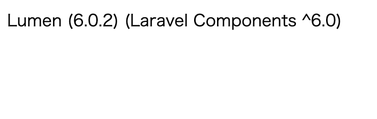

---

# Docker Composeを使おう#25

ApacheとPHPの設定をできるようにします

```
$ mkdir docker/web/sites-enabled
$ mkdir docker/web/php
$ touch docker/web/sites-enabled/000-default.conf
$ touch docker/web/php/php.ini
```

今回は `php.ini` は編集しませんが、触る機会は多いので入れています

---

# Docker Composeを使おう#26

DocumentRootをLumenのpublicフォルダにします  
また `docker-compose.yml` でマウントするフォルダにsampleを指定します

```
# docker/web/sites-enabled/000-default.conf
<VirtualHost *:80>
	ServerAdmin webmaster@localhost
	DocumentRoot /var/www/html/public
	ErrorLog ${APACHE_LOG_DIR}/error.log
	CustomLog ${APACHE_LOG_DIR}/access.log combined
</VirtualHost>
```

```yml
# docker-compose.yml
web:
  volumes: # ./:/var/www/htmlから書き換え
      - ./sample:/var/www/html
```

[docker-compose.yml](https://github.com/sugumura/kis-open-seminar-docker/blob/step5/lamp/docker-compose.yml)<!--- .element target="_blank" rel="noopener" -->

---

# Docker Composeを使おう#27

ビルド時に各設定ファイルをコピーします

```
# docker/web/Dockerfile
...
# 3行追加
COPY ./docker/web/php/php.ini /usr/local/etc/php/
COPY ./docker/web/sites-enabled/*.conf /etc/apache2/sites-enabled/
WORKDIR /var/www/html

EXPOSE 80
```

[Dockerfile](https://github.com/sugumura/kis-open-seminar-docker/blob/step5/lamp/docker/web/Dockerfile)<!--- .element target="_blank" rel="noopener" -->

---

# Docker Composeを使おう#28

ビルドして再起動します

```
$ docker-compose build web
$ docker-compose down
$ docker-compose up -d
```

ルートでアクセスできるようになります

[http://localhost:8000](http://localhost:8000)<!--- .element target="_blank" rel="noopener" -->

---

# Docker Composeを使おう#29

最後にLumenのマイグレーションを行いMySQLが使えることを確認します  
Lumenの `.env` を書き換えます

```
# sample/.env
# DB_HOST, DB_DATABASE, DB_USERNAME, DB_PASSWORD を書き換え
DB_CONNECTION=mysql
DB_HOST=db
DB_PORT=3306
DB_DATABASE=sample
DB_USERNAME=root
DB_PASSWORD=password
```

---

# Docker Composeを使おう#30

マイグレーションをします

```
# postsテーブルを作成
$ docker-compose exec web php artisan make:migration create_posts_table --create=posts
Created Migration: 2019_09_17_173710_create_posts_table

# マイグレーション
$ docker-compose exec web php artisan migrate
Migration table created successfully.
Migrating: 2019_09_17_173710_create_posts_table
Migrated:  2019_09_17_173710_create_posts_table (0.03 seconds)
```

---

# Docker Composeを使おう#30

Adminerで確認すると作成されたテーブルが見えます

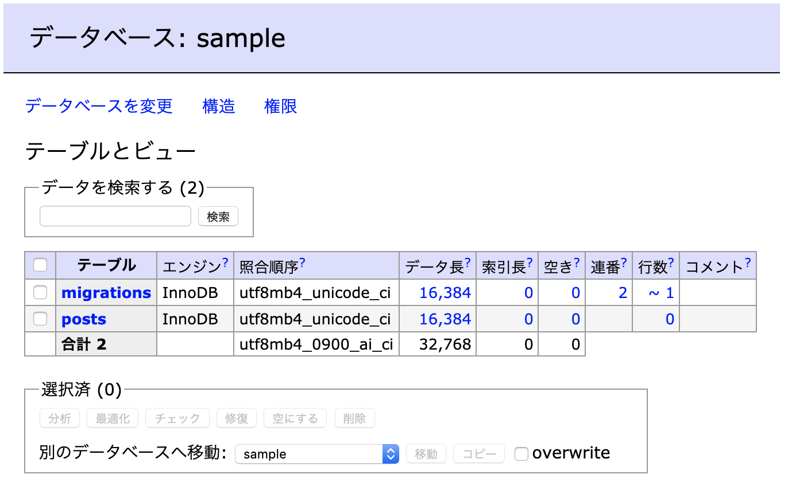

---

# 終わりに

今回の環境構築はあくまで一例です  
php-fpmとapacheイメージを個別に使って構築するものもあれば、nginxを利用したものもあります  

一時的な成果物のためのマルチステージビルドといった機能も導入されできることは増えています  
ぜひ今回登場していない命令や機能を使って試してみてください

---

# 後始末

今回ダウンロードしたイメージやコンテナで容量を使用するため、不要な場合は削除してください

```
# コンテナ一覧
$ docker ps -a
# コンテナ削除
$ docker rm [NAMES or CONTAINER_ID]

# イメージ一覧
$ docker images
# イメージ削除
$ docker rmi [IMAGE_ID]

# ボリューム一覧
$ docker volume ls
# ボリューム削除
$ docker volume rm [VOLUME_NAME]
```

---

# 参考資料

- [Get Started](https://docs.docker.com/get-started/)<!--- .element target="_blank" rel="noopener" -->
- [Dockerイメージの理解とコンテナのライフサイクル](https://www.slideshare.net/zembutsu/docker-images-containers-and-lifecycle)<!--- .element target="_blank" rel="noopener" -->
- [入門 Docker](https://y-ohgi.com/introduction-docker/)<!--- .element target="_blank" rel="noopener" -->
- [プログラマのためのDocker教科書 第2版](https://www.shoeisha.co.jp/book/detail/9784798153223)<!--- .element target="_blank" rel="noopener" -->

---

# おつかれさまでした🍵
