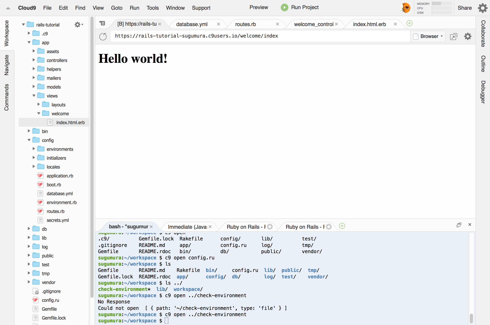
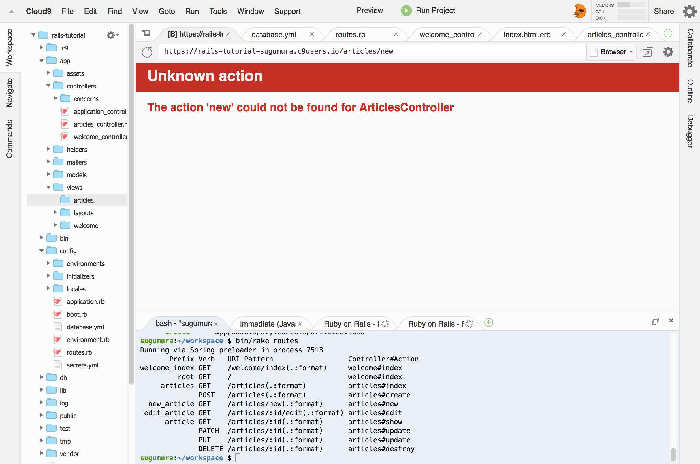
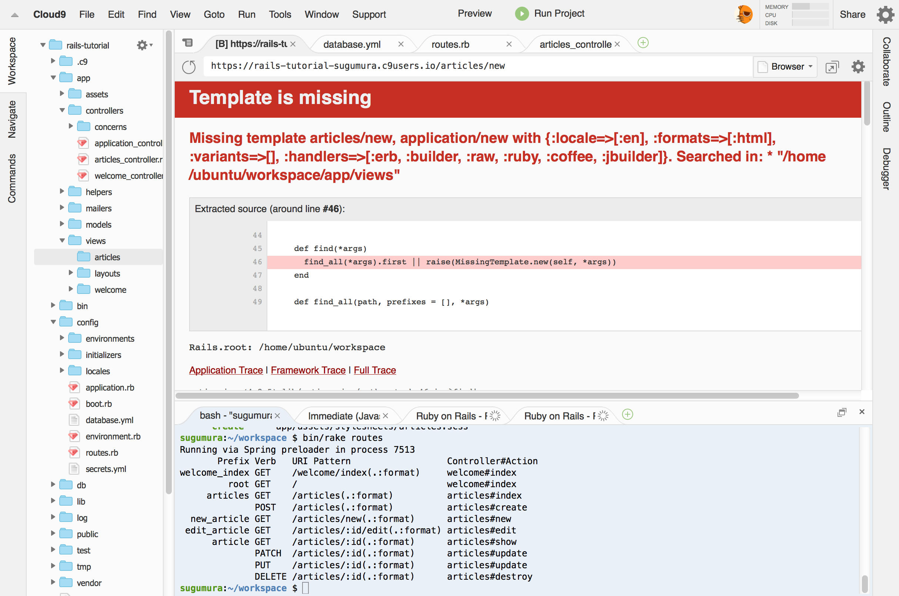
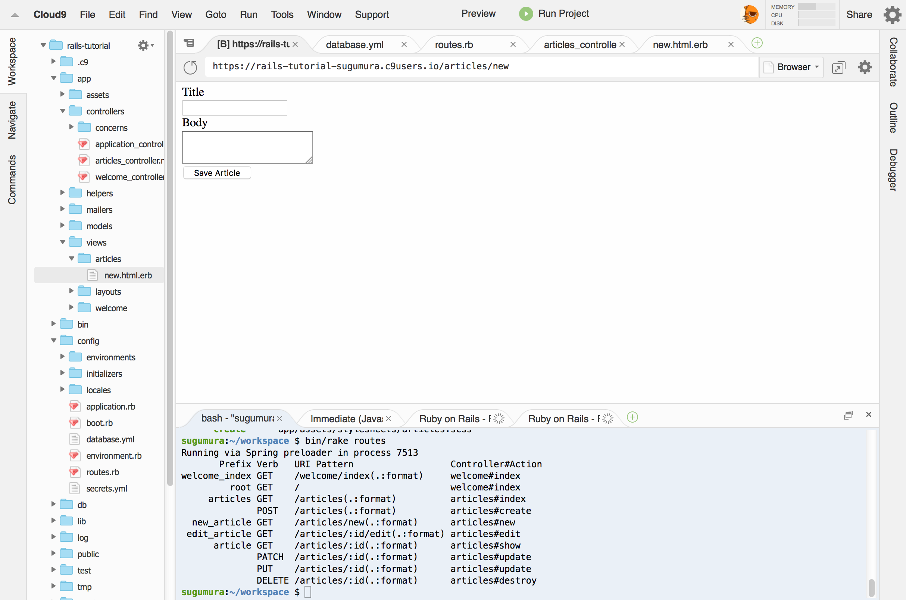
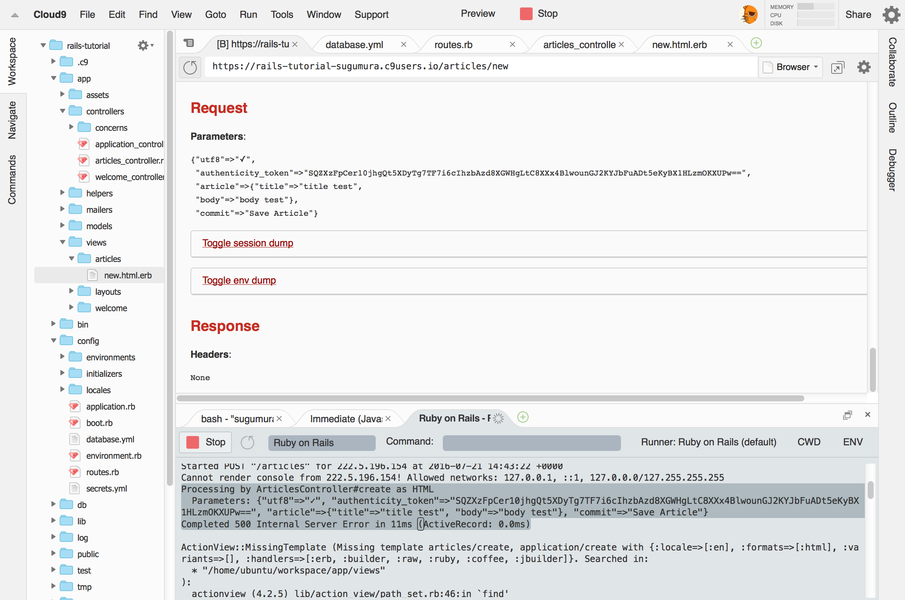
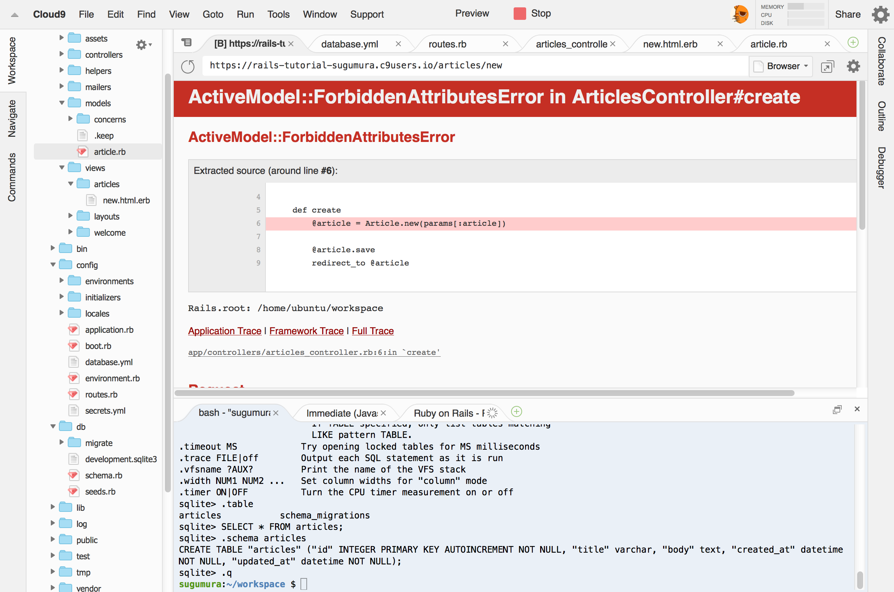

# Ruby on Railsで！<br>WEBアプリケーション勉強会
2016年8月3日

協力 **未来会議室** 

---

# 自己紹介

- 村上　卓
- 29歳
- フリーランス
- AngularJS/Ruby On Rails

---

# 今日はRuby on Railsを使って簡易ブログを<br>作ります

---

# 方針

- 概念的な説明はしません（MVC、CoC、DRY...)
- とにかく書いて動かしてもらいます

---

# Ruby on Railsとは？

- Webアプリケーションを作成するための<br>フレームワーク（OSS)
- プログラミング言語Rubyを使用

RoR、Railsとよく省略して表記されます

Note: DHH(デイヴィッド・ハイネマイヤー・ハンソン (David Heinemeier Hansson))デンマーク

___

# 利用例

- Cookpad
- 食べログ
- Hulu
- Airbnb

---

# 開発環境

---

# Cloud9

- クラウド開発環境
- ブラウザでIDEが利用可能

最近アマゾンに買収されました

[Great News!](https://c9.io/blog/great-news/)

---

<!-- .slide: data-background="image/pp-cloud9-ide.png" -->

---

# Cloud9でプロジェクトを作成

- Create a new workspaceを選択

---

<!-- .slide: data-background="image/pp-cloud9-create.png" -->

---

# Ruby on Railsの環境

- Workspace nameに「rails-tutorial」と入力
- Choose a templateで「Ruby」を選択


---

<!-- .slide: data-background="image/pp-cloud9-select-env.png" -->

---

<!-- .slide: data-background="image/pp-cloud9-ide.png" -->

---

<!-- .slide: data-background="image/pp-cloud9-ide-desc.png" -->

---

# 実行

- 「Run Project」を押す
- 「Preview」を押す
    - 「Preview Runnning Application」ボタンを押す

---

<!-- .slide: data-background="image/pp-cloud9-ide-show-preview.png" -->

---

<!-- .slide: data-background="image/pp-cloud9-ide-preview.png" -->

---

# 開発環境完成！

---

# Hello world

コマンドを使用してコントローラーとビューを作成

```
$ bin/rails generate controller welcome index
```

---

# 作成されたファイル

```
create  app/controllers/welcome_controller.rb
route  get 'welcome/index'
invoke  erb
create    app/views/welcome
create    app/views/welcome/index.html.erb
invoke  test_unit
create    test/controllers/welcome_controller_test.rb
invoke  helper
create    app/helpers/welcome_helper.rb
invoke    test_unit
invoke  assets
invoke    coffee
create      app/assets/javascripts/welcome.coffee
invoke    scss
create      app/assets/stylesheets/welcome.scss
```

---

# ビューの変更
ファイルツリーでindex.html.erbファイルを開きます
```
app/views/welcome/index.html.erb
```


中身を削除して書き換えます
```html
<h1>Hello world!</h1>
```

---

# 結果

`/welcom/index` にアクセス



---

# ルートに変更
ファイルツリーでroutes.rbファイルを開きます
```
config/routes.rb
```

rootを追加
```
Rails.application.routes.draw do
  get 'welcome/index'
  root 'welcome#index' # 追加

  # #はコメントです
end
```

---

# 結果

`/` にアクセスすると先ほどのHello worldが表示

---

# ブログ投稿ページの作成
再度、generateコマンドを利用

```
# gはgenerateの省略形
$ bin/rails g controller articles
```

---

# ルーティングにarticlesを追加
ファイルツリーでroutes.rbファイルを開きます
```
config/routes.rb
```

```

get 'welcome/index'
root 'welcome#index'

resources :articles # 追加

```

---

# ルーティング確認

`rake routes` コマンドを利用することで  
有効なパス一覧を表示する

```
$ bin/rake routes

Prefix Verb   URI Pattern                  Controller#Action
welcome_index GET    /welcome/index(.:format)     welcome#index
         root GET    /                            welcome#index
     articles GET    /articles(.:format)          articles#index
              POST   /articles(.:format)          articles#create
  new_article GET    /articles/new(.:format)      articles#new
 edit_article GET    /articles/:id/edit(.:format) articles#edit
      article GET    /articles/:id(.:format)      articles#show
              PATCH  /articles/:id(.:format)      articles#update
              PUT    /articles/:id(.:format)      articles#update
              DELETE /articles/:id(.:format)      articles#destroy
```

---

# エラー確認

`/articles/new` にアクセス



---

# アクション追加

ファイルツリーでarticles_controller.rbファイルを開きます
```
app/controllers/articles_controller.rb
```

newメソッドを追加
```
class ArticlesController < ApplicationController
    def new
    end
end
```

---

# エラー確認

`/articles/new` にアクセス



---

# ビュー追加

ファイルツリーで新規ファイル`new.html.erb`を作成

```
app/views/new.html.erb
```

`/articles/new` にアクセスすると真っ白ページ

---

# フォームを追加

`/articles/new` に記述

```
<%= form_for :article, url: articles_path do |f| %>
  <div>
    <div><%= f.label :title %></div>
    <div><%= f.text_field :title %></div>
 
    <div><%= f.label :body %></div>
    <div><%= f.text_area :body %></div>

    <div><%= f.submit %></div>
  </div>
<% end %>
```

---

# フォーム表示



---

# アクションの追加

- 「Save Article」ボタンを押す
-  エラー「The action 'create' could not be found for ArticlesController」
- Articlesコントローラーにcreateアクションを追加

---

# createアクション

```
# app/controllers/articles_controller.rb
class ArticlesController < ApplicationController
    def new
    end

    def create # 追加
    end
end
```

---

# エラー画面について

送信内容はエラー画面や、ログに表示



---

# モデル作成

データベースに保存するため、モデルコマンドを実行

```
$ bin/rails g model Article title:string body:text

      invoke  active_record
      create    db/migrate/20160721151502_create_articles.rb
      create    app/models/article.rb
      invoke    test_unit
      create      test/models/article_test.rb
      create      test/fixtures/articles.yml

```

---

# マイグレーション

マイグレーションを実行して、データベースにテーブルを作成

```
$ bin/rake db:migrate

== 20160721151502 CreateArticles: migrating ===========
-- create_table(:articles)
   -> 0.0028s
== 20160721151502 CreateArticles: migrated (0.0033s) ==
```

---

# データベース確認

```
$ sqlite3 db/development.sqlite3

sqlite> .table
articles           schema_migrations

sqlite> .schema articles
CREATE TABLE "articles" (
    "id" INTEGER PRIMARY KEY AUTOINCREMENT NOT NULL,
    "title" varchar, "body" text,
    "created_at" datetime NOT NULL,
    "updated_at" datetime NOT NULL
);
```

---

# createアクション

保存処理を追加

```
# app/controllers/articles_controller.rb
def create
    @article = Article.new(params[:article])    
    @article.save
    
    # /articles/new にリダイレクト
    redirect_to @article
end
```

---

# 送信テスト

タイトルとボディに文字を入力して送信



---

# 項目ホワイトリスト

Mass Assignment 脆弱性への対応  
送信項目を明示的に記述

```
# app/controllers/articles_controller.rb
def create
    @article = Article.new(article_params)
    @article.save
    
    # /articles/new にリダイレクト
    redirect_to @article
end

private
  def article_params
    params.require(:article).permit(:title, :body)
  end
```

---

# 送信テスト

タイトルとボディに文字を入力して送信

エラー「The action 'show' could not be found for ArticlesController」

データベースには保存済み

```
sqlite> SELECT * FROM articles;
1|test|test|2016-07-21 16:29:15.555148|2016-07-21 16:29:15.555148
```

---

# showアクション

```
# app/controllers/articles_controller.rb

def show
  @article = Article.find(params[:id])
end

def new
    ...
end

```

Note: article GET    /articles/:id(.:format)      articles#show

---

# showビュー

show.html.erbを作成

```
<!-- app/views/articles/show.html.erb -->
<div>
  <strong>Title:</strong>
  <%= @article.title %>
</div>
 
<div>
  <strong>Text:</strong>
  <%= @article.body %>
</div>
```

---

# 送信テスト成功！

---

# 記事一覧を表示

`/articles` で投稿記事の一覧を表示

- コントローラーにindexアクションを追加
- ビューに一覧を展開

---

# index
```
# app/controllers/articles_controller.rb
def index
  @articles = Article.all
end

def show
...
end
```

```
# app/views/articles/index.html.erb
<table>
  <tr>
    <th>Title</th>
    <th>Body</th>
  </tr>
 
  <% @articles.each do |article| %>
    <tr>
      <td><%= article.title %></td>
      <td><%= article.body %></td>
    </tr>
  <% end %>
</table>
```

---

<!-- .slide: data-background="image/pp-cloud9-index.png" -->

---

# おつかれさまでした！

---

# 今回のチュートリアル

実は公式のGetting Started  
ぜひ続きを試してください

[Rails をはじめよう (日本語訳)](http://railsguides.jp/getting_started.html)

---

# 次回？のためのアンケート

- 今回のチュートリアルの続き
- 他言語/フレームワークなどのハンズオン
    - PHP/Javascript/Java/Python/Ruby/Swift...
- 開発ツールの紹介
    - バージョン管理/プロジェクト管理/コミュニケーションツール/CI
- クラウドコンピューティング
    - AWS/GCP/Azure
