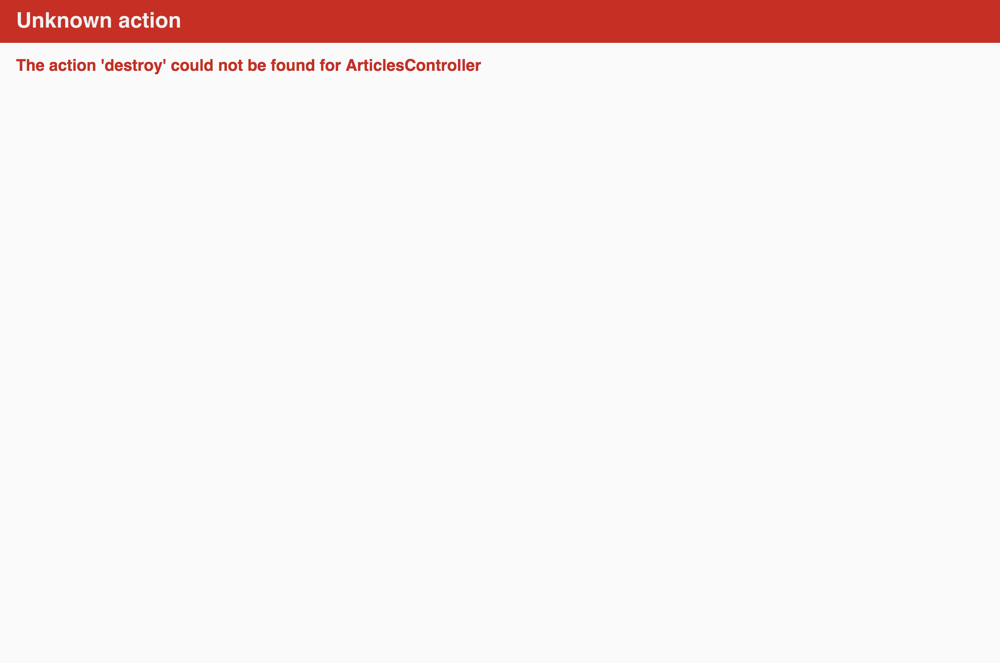
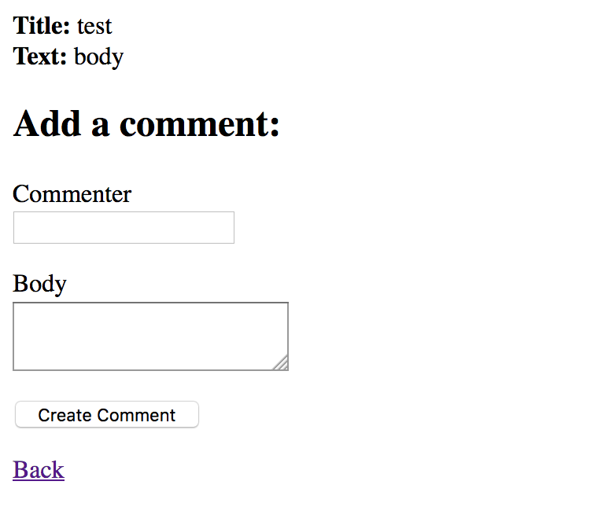
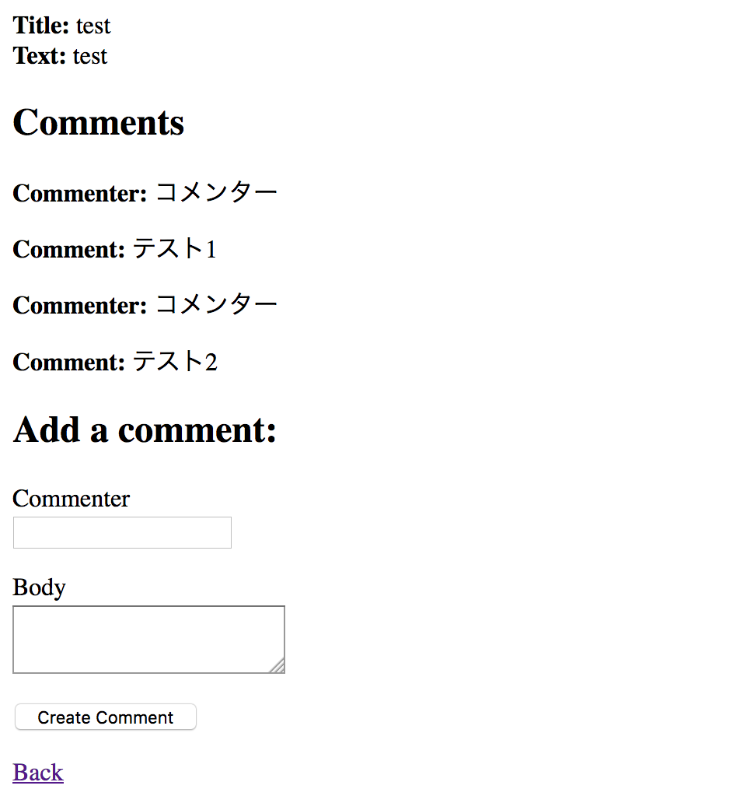

# Rubyの基本から<br>Blogシステム作成編
2016年9月7日

協力 **未来会議室**

---

# 自己紹介

- 村上　卓
- 29歳
- フリーランス
- AngularJS/Ruby On Rails

---

# 今日は8月3日に行われた「Ruby on Railsで！WEBアプリケーション勉強会」の続きです

---

# 初参加の方

- 概念的な説明はしません（MVC、CoC、DRY...)
- とにかく書いて動かしてもらいます

---

# Ruby on Railsとは？

- Webアプリケーションを作成するための<br>フレームワーク（OSS)
- プログラミング言語Rubyを使用

RoR、Railsとよく省略して表記されます

Note: DHH(デイヴィッド・ハイネマイヤー・ハンソン (David Heinemeier Hansson))デンマーク

___

# 利用例

- Cookpad
- 食べログ
- Hulu
- Airbnb

---

# 開発環境

---

# Cloud9

- クラウド開発環境
- ブラウザでIDEが利用可能

---

<!-- .slide: data-background="image/pp-cloud9-ide.png" -->

---

# Cloud9でプロジェクトを作成

- Create a new workspaceを選択

---

<!-- .slide: data-background="image/pp-cloud9-create.png" -->

---

# Ruby on Railsの環境

- Workspace nameに「rails-tutorial」と入力
- Choose a templateで「Ruby」を選択
- Clone from Git or Mercurial URLに下記URLを追加
    - URLを入れることで前回のソースをダウンロードしてきます

```
https://github.com/sugumura/ror-first-tutorial
```

---

<!-- .slide: data-background="image/20160907/new-workspace.png" -->

---

<!-- .slide: data-background="image/pp-cloud9-ide.png" -->

---

<!-- .slide: data-background="image/pp-cloud9-ide-desc.png" -->

---

# 実行環境の更新

コマンドラインで実行

Rialsで利用するライブラリの更新

```
$ bundle install
```

データベースの作成・更新

```
$ ./bin/rake db:migrate
```

---

# 実行

- 「Run Project」を押す
- 「Preview」を押す
    - 「Preview Runnning Application」ボタンを押す

---

<!-- .slide: data-background="image/pp-cloud9-ide-show-preview.png" -->

---

<!-- .slide: data-background="image/20160907/init-hello.png" -->

---

# 開発環境完成！

---

# 前回の復習

---

# 既存機能

- 記事の作成
- 記事の表示
- 記事の一覧

---

# 削除機能

削除ボタンを追加  
ファイルツリーでindex.html.erbを開く

`app/views/articles/index.html.erb`

```
<tr>
    <th>Title</th>
    <th>Body</th>
    <th>Delete</th>
</tr>

<% @articles.each do |article| %>
<tr>
  <td><%= link_to article.title, article %></td>
  <td><%= article.body %></td>
  <td><%= link_to 'Delete', article_path(article),
    method: :delete %></td>
</tr>
<% end %>
```

---

# エラー確認

削除ボタンを押す



---

# destroyアクション

コントローラーにdestroyアクションを追加  
`app/controllers/articles_controller.rb`

```
def create
...
end

def destroy
  @article = Article.find(params[:id])
  @article.destroy

  redirect_to articles_path
end
```

---

# 再実行

Destroyボタンを押すと記事が削除されて一覧に戻ります

---

# 対応一覧

| 機能 | URL              | アクション | ビュー         |
|------|------------------|------------|----------------|
| 一覧 | /articles/       | index      | index.html.erb |
| 作成 | /articles        | create     |                |
| 詳細 | /articles/1      | show       | show.html.erb  |
| 削除 | /articles/1      | destroy    |                |

* 他に編集(edit)と更新(update)があります

---

# コメント機能

記事ごとにコメントをつけられるようにしましょう  

---

# コメントの仕様

- コメントは1つの記事(Article)に追加されます
- コメントは記事に対して複数できます

1つの記事に対して複数のコメントが紐づく  
こういった関係を *一対多* の関係といいます

---

# コメントモデルの作成

モデル名: Comment

```
$ ./bin/rails g model Comment commenter:string body:text  article:references
```

```
Running via Spring preloader in process 8000
      invoke  active_record
      create    db/migrate/20160907085827_create_comments.rb
      create    app/models/comment.rb
      invoke    test_unit
      create      test/models/comment_test.rb
      create      test/fixtures/comments.yml
```

---

# マイグレーション

マイグレーションを行うことで  
データベースにCommentsテーブルを作成

```
$ ./bin/rake db:migrate
```

```
Running via Spring preloader in process 8012
== 20160907085827 CreateComments: migrating ==
-- create_table(:comments)
   -> 0.0031s
== 20160907085827 CreateComments: migrated (0.0032s) ==
```

---

# テーブル確認

```
$ sqlite3 db/development.sqlite3
sqlite> .table
articles           comments           schema_migrations

sqlite> .schema comments
CREATE TABLE "comments" (
    "id" INTEGER PRIMARY KEY AUTOINCREMENT NOT NULL,
    "commenter" varchar,
    "body" text,
    "article_id" integer,
    "created_at" datetime NOT NULL,
    "updated_at" datetime NOT NULL
);
CREATE INDEX "index_comments_on_article_id"
    ON "comments" ("article_id");
```

---

# コメントモデル

`belongs_to` でArticleモデルに関連指定

`app/models/comment.rb`

```
class Comment < ActiveRecord::Base
  belongs_to :article
end
```

---

# アーティクルモデル

Articleモデルに関連指定を追加

`app/models/article.rb`

```
class Article < ActiveRecord::Base
  has_many :comments
end
```

---

# コメントへのルーティング

コメントモデルを扱うためにルーティングを設定

`config/routes.rb`

```
root 'welcome#index'

resources :articles do
    resources :comments
end
```

---

# コメントコントローラ

```
$ ./bin/rails g controller Comments
```

```
      create  app/controllers/comments_controller.rb
      invoke  erb
      create    app/views/comments
      invoke  test_unit
      create    test/controllers/comments_controller_test.rb
      invoke  helper
      create    app/helpers/comments_helper.rb
      invoke    test_unit
      invoke  assets
      invoke    coffee
      create      app/assets/javascripts/comments.coffee
      invoke    scss
      create      app/assets/stylesheets/comments.scss
```

---

# コメント入力を追加

Backリンクの前に追加  
`app/views/articles/show.html.erb`

```
<h2>Add a comment:</h2>
<%= form_for([@article, @article.comments.build]) do |f| %>
  <p>
    <%= f.label :commenter %><br>
    <%= f.text_field :commenter %>
  </p>
  <p>
    <%= f.label :body %><br>
    <%= f.text_area :body %>
  </p>
  <p>
    <%= f.submit %>
  </p>
<% end %>

<%= link_to 'Back', articles_path %>

```

---

# コメント入力の表示




---

# エラー確認

Create Commentボタンを押す


---

# コメントコントローラ

`app/controllers/comments_controller.rb`

```
class CommentsController < ApplicationController
  def create
    @article = Article.find(params[:article_id])
    @comment = @article.comments.create(comment_params)
    redirect_to article_path(@article)
  end

  private
    def comment_params
      params.require(:comment).permit(:commenter, :body)
    end
end
```

---

# コメントテスト

CommenterとBodyに値を入れて「Create Comment」  

- インプットボックスの値が空になる  
    - コメントは保存されたが表示されていない

---

# コメント表示

コメント入力の前に追加  
`app/views/articles/show.html.erb`


```
<h2>Comments</h2>
<% @article.comments.each do |comment| %>
  <p>
    <strong>Commenter:</strong>
    <%= comment.commenter %>
  </p>

  <p>
    <strong>Comment:</strong>
    <%= comment.body %>
  </p>
<% end %>
```

---

# コメント表示



---

# おつかれさまでした！

---

# 今回のチュートリアル

実は公式のGetting Started
ぜひ続きを試してください

[Rails をはじめよう (日本語訳)](http://railsguides.jp/getting_started.html)
